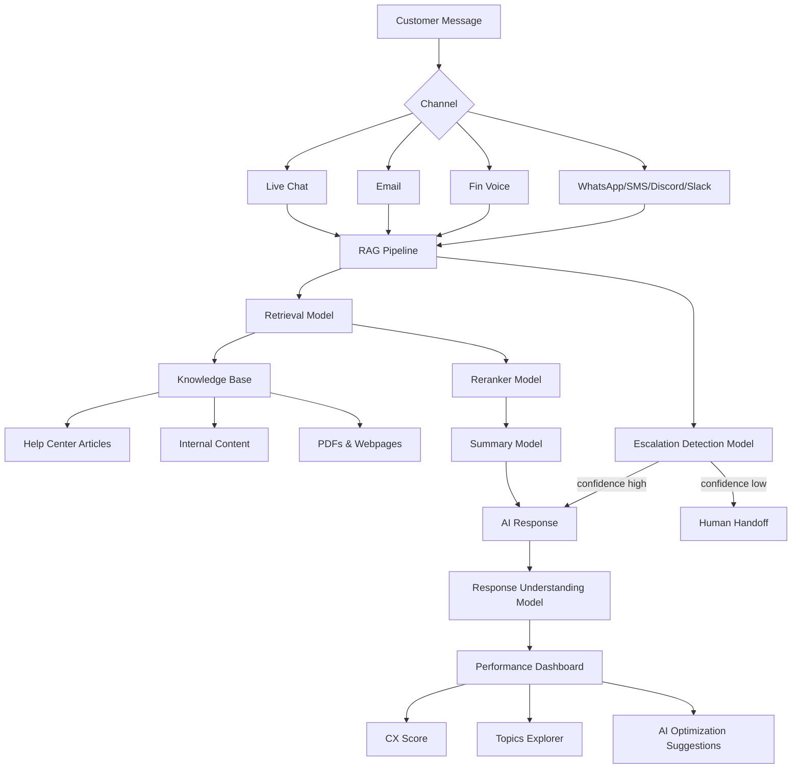

# Intercom Fin

> **The #1 AI Agent for customer service — resolution-based pricing, RAG-powered, multi-channel support.**

| Field | Value |
|-------|-------|
| Category | ⚙️ Agent Harnesses |
| Repository | Proprietary (closed-source SaaS) |
| GitHub Stars | N/A (proprietary) |
| Publisher | Intercom (bigtech — publicly traded, est. 2011) |
| License | Proprietary / Commercial |
| Tech Stack | RAG pipeline (retrieval + reranker + summary + escalation models), multi-channel (chat, email, phone, Slack, Discord, WhatsApp, SMS) |
| Maturity | 🟢 Production |
| Last Analyzed | 2026-03-08 |

---

## Burak's Notes

> *[Your personal observations, gut reactions, open questions, or ideas for how this tool connects to ongoing work. This section is yours — agents won't overwrite it.]*

---

## Relevance Scores

| Dimension | Score | Notes |
|-----------|-------|-------|
| **Relevance to our vision** | 2/10 | Customer support AI is a completely different problem domain. We orchestrate coding agents, not support conversations. No architectural overlap. |
| **Novelty** | 3/10 | RAG-powered customer support with resolution-based pricing is well-known. The multi-model pipeline (retrieval → reranker → summary → escalation detection) is standard RAG architecture. |
| **Actionable** | 1/10 | Nothing adoptable. Different domain, proprietary, closed-source, SaaS-only. We can't study implementation details. |

---

## Overview

Intercom Fin is the market-leading AI agent for customer service, handling support conversations across chat, email, phone (Fin Voice), Slack, Discord, WhatsApp, and SMS. It uses a multi-layer RAG architecture: a retrieval model identifies potential answers from the knowledge base, a reranker prioritizes optimal content, a summary model contextualizes the response, an escalation detection model determines when to hand off to humans, and a response understanding model evaluates conversation quality.

Fin achieves a 66% average resolution rate across all customers (increasing ~1% monthly) and claims 99.9% accuracy in its Fin 2 release. It learns from Help Center articles, internal support content, PDFs, and webpages, with content targeting based on customer plan, location, and brand. Setup takes under an hour by connecting to an existing helpdesk (Zendesk, Salesforce, HubSpot, Freshworks, or Intercom's own).

The pricing model is outcome-based: $0.99 per successful resolution with a 50-resolution monthly minimum. No per-seat costs for Fin itself. When used standalone (without Intercom), there's a $49/mo base subscription. When used with Intercom's helpdesk, helpdesk seats are $29/mo each. This resolution-based pricing is frequently cited as innovative in the customer support space.

---

## Technical Architecture

**Key architectural layers:**

| Layer | Purpose | Detail |
|-------|---------|--------|
| **Retrieval Model** | Find candidate answers | Searches across all configured knowledge sources |
| **Reranker** | Prioritize best content | Ensures most relevant answer surfaces |
| **Summary Model** | Contextualize response | Adapts retrieved content to conversation context |
| **Escalation Detection** | Human handoff trigger | Determines when AI can't handle the query |
| **Response Understanding** | Quality tracking | Post-response analysis for analytics and improvement |
| **Content Targeting** | Personalization | Filters knowledge by customer plan, location, brand |

**Pricing model:**

| Tier | Cost | Details |
|------|------|---------|
| Fin standalone | $49/mo + $0.99/resolution | 50 included resolutions |
| Fin + existing helpdesk | $0.99/resolution | Works with Zendesk, Salesforce, HubSpot, etc. |
| Fin + Intercom helpdesk | $29/seat/mo + $0.99/resolution | Full Intercom suite |
| Copilot add-on | $35/user/mo | AI assistant for human agents |
| Fin Voice | Custom pricing | Phone support channel |

---

## Publisher Background

Intercom was founded in 2011, headquartered in San Francisco. It's one of the largest customer communication platforms with a long track record in the support space. The company pivoted aggressively to AI with Fin, positioning it as their primary growth driver. Intercom has raised significant venture funding and has thousands of enterprise customers. The Fin team leverages Intercom's massive dataset of real customer service interactions for model training. Led by CEO Eoghan McCabe, the company has been vocal about "preparing for the Customer Agent future" where AI agents handle the majority of customer interactions.

---

## What's Valuable for Us

| Pattern to Study | Where in Fin | How to Apply |
|-----------------|-------------|--------------|
| **Resolution-based pricing model** | Core billing | If we ever productize our orchestrator as a service, outcome-based pricing ($X per successful task completion) is a compelling alternative to per-seat or per-token pricing. Study how they define and verify "resolution." |
| **Multi-model pipeline (retrieval → reranker → summary → escalation)** | RAG architecture | The staged pipeline concept (multiple specialized models in sequence, each with a specific job) is a general pattern we could apply to our agent task processing — though we'd use different models for different purposes. |
| **Escalation detection** | Confidence-based handoff | Knowing when an agent should hand off to a human is relevant for our orchestrator. Their escalation model concept could inform our roadblock detection. |

---

## What's NOT Relevant

| Concern | Why |
|---------|-----|
| **Customer support domain** | We build coding agent orchestration, not support chatbots. Zero domain overlap. |
| **Proprietary SaaS** | Closed-source, no code to study. We can only learn from their published architecture decisions, not from implementation details. |
| **RAG-centric architecture** | Our orchestrator doesn't do retrieval-augmented generation. Our agents have direct codebase access via Claude Code CLI. |
| **Channel diversity (chat, email, phone, WhatsApp)** | Irrelevant to our terminal-first, tmux-based workflow. |
| **Knowledge base management** | We don't maintain a customer-facing knowledge base. Our "knowledge" is the codebase itself. |

---

## Future Use Cases

- **Phase 1–3:** Not relevant. Different domain entirely.
- **Phase 4 (Days 90+):** If productizing the orchestrator as a service, study Fin's resolution-based pricing as a model for outcome-based billing. If building client-facing support for our SaaS products, Fin could be a vendor option (but that's a business decision, not an architecture one).

---

## Key Takeaway

> **Intercom Fin is the gold standard for AI customer support but operates in a completely different domain from our work — the only transferable insight is their outcome-based pricing model ($0.99/resolution), which is worth studying if we ever productize our orchestrator.**
