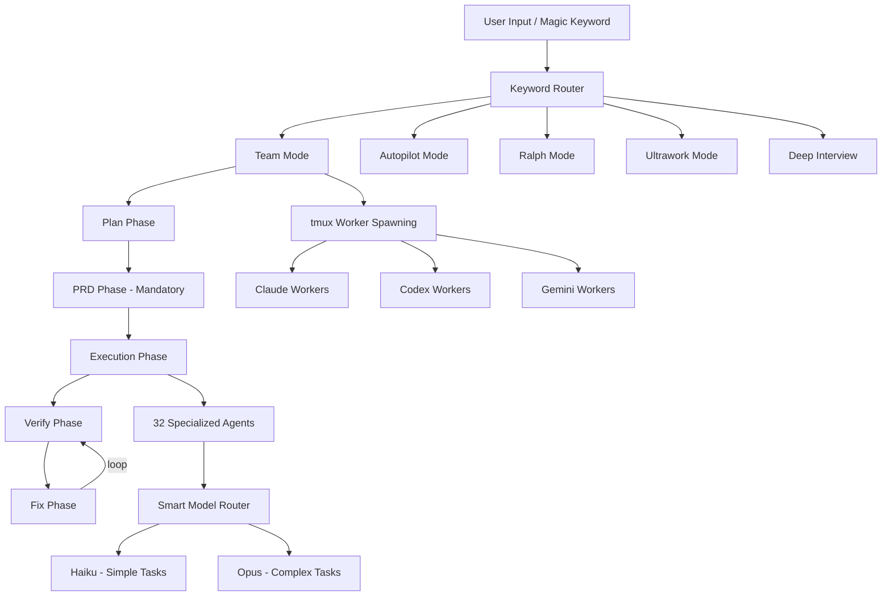

# oh-my-claudecode

> **Teams-first multi-agent orchestration for Claude Code. Zero learning curve.**

| Field | Value |
|-------|-------|
| Category | ⚙️ Agent Harnesses |
| Repository | [Yeachan-Heo/oh-my-claudecode](https://github.com/Yeachan-Heo/oh-my-claudecode) |
| GitHub Stars | 8,800 (as of 2026-03-08) |
| Publisher | Yeachan-Heo (solo → community) |
| License | MIT |
| Tech Stack | TypeScript, Claude Code CLI, tmux, npm (published as oh-my-claude-sisyphus) |
| Maturity | 🟢 Production |
| Last Analyzed | 2026-03-08 |

---

## Burak's Notes

> *[Your personal observations, gut reactions, open questions, or ideas for how this tool connects to ongoing work. This section is yours — agents won't overwrite it.]*

---

## Relevance Scores

| Dimension | Score | Notes |
|-----------|-------|-------|
| **Relevance to our vision** | 8/10 | Directly competes with and extends what we built. Same stack (Claude Code + tmux), same problem space. Their Team mode, Ralph loops, and smart model routing are patterns we should study closely. |
| **Novelty** | 6/10 | Many patterns overlap with our L-Thread Orchestrator (tmux spawning, role-based agents, magic keywords). HUD statusline, deep-interview skill, and smart model routing (Haiku for simple, Opus for complex) are genuinely new. |
| **Actionable** | 7/10 | Can install as a Claude Code plugin today. Their 32 specialized agent prompts are directly readable and adaptable. The HUD statusline pattern could be added to our orchestrator within a day. |

---

## Overview

oh-my-claudecode (OMC) is the most popular Claude Code plugin/harness, with 8.8K GitHub stars and 1,791 commits. It provides a suite of 32 specialized agents and 37 skills that layer on top of Claude Code, turning it from a single-agent coding tool into a multi-agent orchestration platform. The plugin is installed via Claude's plugin marketplace and activated through "magic keywords" — typing `team`, `autopilot`, `ralph`, `ulw`, or `deep-interview` triggers different orchestration modes.

The project has evolved through several paradigm shifts. Starting in v4.1.7, "Team" became the canonical orchestration surface, replacing the legacy "swarm" abstraction. The Team mode implements a staged pipeline: plan, PRD (mandatory as of recent releases), exec, verify, fix — ensuring every task goes through structured phases before completion. The Ralph mode adds persistence with verify/fix loops until convergence.

OMC also provides smart model routing, automatically dispatching simple tasks to Haiku and complex reasoning to Opus, which optimizes cost without sacrificing quality. The `omc team` CLI can spawn tmux workers running Claude, Codex, or Gemini for true multi-model parallel execution.

---

## Technical Architecture

**Key components:**

| Component | Purpose | Notable Detail |
|-----------|---------|----------------|
| **32 Specialized Agents** | Architecture, research, design, testing, data science domains | Each agent has a focused prompt with domain expertise |
| **37 Skills** | Reusable capabilities agents can invoke | Includes deep-interview (Socratic questioning), deepsearch, ultrathink |
| **HUD Statusline** | Real-time metrics display | Shows agent status, cost tracking, task progress in terminal |
| **31 Lifecycle Hooks** | Behavioral enhancement points | Hook into Claude Code's execution at 31 different points |
| **Language Server Integration** | Structural code analysis | LSP integration for more accurate code understanding |
| **Persistent State** | Cross-session memory | Survives Claude Code restarts |
| **Magic Keywords** | Zero-config activation | `team`, `autopilot`, `ralph`, `ulw`, `deep-interview` |

**Security note:** A recent patch release addressed SSRF and shell injection vulnerabilities, indicating the project takes security seriously but has had real attack surface issues.

---

## Publisher Background

Yeachan-Heo is the primary author with 1,791 commits to main. The project has grown from a solo effort into a community-maintained plugin with significant adoption (8.8K stars). The high commit count and rapid versioning (v4.1.7+ with frequent patches) suggest active, fast-moving development. The npm package is published as `oh-my-claude-sisyphus`. The project has spawned forks and community extensions, including a separate plugin marketplace by huangdijia.

---

## What's Valuable for Us

| Pattern to Study | Where in OMC | How to Apply |
|-----------------|-------------|--------------|
| **Smart model routing** | Model router module | Our orchestrator could route simple tasks (file moves, formatting) to Haiku and reserve Opus for architectural decisions — immediate cost savings |
| **HUD statusline** | HUD module | A persistent terminal status bar showing active agents, costs, and task progress would improve our orchestrator's observability without needing a full dashboard |
| **Staged pipeline (plan→PRD→exec→verify→fix)** | Team mode | Our L-Thread pattern is less structured. Adding mandatory PRD and verify/fix loops could improve output quality |
| **Deep-interview skill** | Socratic questioning skill | Requirements elicitation through structured questioning — useful for our client intake process |
| **32 agent prompt library** | Agent definitions | Direct reference for specialized agent prompts — architecture, testing, data science, research roles |
| **Magic keyword activation** | Keyword router | Simpler UX pattern than explicit slash commands — worth considering for our orchestrator |

---

## What's NOT Relevant

| Concern | Why |
|---------|-----|
| **Plugin marketplace model** | OMC is designed as a Claude Code plugin. We run our own orchestrator — we don't want to depend on Claude's plugin system for our core workflow. |
| **Ultrawork mode** | Maximum parallelism without structure conflicts with our 70/30 deterministic/LLM split. We need deterministic routing, not "throw everything at it." |
| **Multi-model CLI spawning** | Their `omc team` spawns Codex and Gemini CLIs via tmux. We're Claude-first by design — adding model diversity adds complexity without clear benefit for our use case. |
| **31 lifecycle hooks** | Deep coupling to Claude Code internals. If Claude Code's hook API changes, this breaks. We prefer prompt-level orchestration that's more resilient to platform changes. |

---

## Future Use Cases

- **Phase 1 (Days 1–3):** Study their 32 agent prompts for role definitions. Adopt smart model routing logic (Haiku for simple, Opus for complex).
- **Phase 2 (Days 4–60):** Consider adding HUD statusline pattern to our tmux orchestrator. Evaluate the plan→PRD→exec→verify→fix pipeline for structured task execution.
- **Phase 3 (Days 60–90):** If building client-facing intake, adapt their deep-interview (Socratic questioning) skill.
- **Phase 4 (Days 90+):** If Claude Code's plugin ecosystem matures, consider whether running OMC alongside our orchestrator adds value vs. complexity.

---

## Key Takeaway

> **oh-my-claudecode is our closest competitor/complement in the Claude Code ecosystem — steal the smart model routing, HUD statusline, and staged pipeline patterns, but don't adopt it wholesale because its plugin-based architecture conflicts with our prompt-engineering-first, deterministic orchestration approach.**
