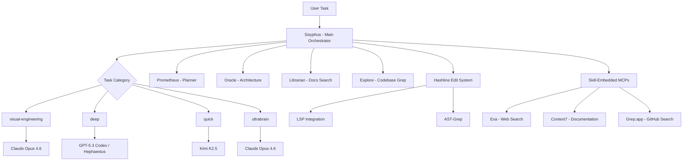

# oh-my-opencode (oh-my-openagent)

> **The best agent harness — multi-model orchestration for LLM-powered development, previously oh-my-opencode.**

| Field | Value |
|-------|-------|
| Category | ⚙️ Agent Harnesses |
| Repository | [code-yeongyu/oh-my-openagent](https://github.com/code-yeongyu/oh-my-openagent) |
| GitHub Stars | 38,000 (as of 2026-03-08) |
| Publisher | code-yeongyu / Yeongyu (solo → community) |
| License | SUL-1.0 |
| Tech Stack | TypeScript, npm, multi-CLI (Claude, Kimi, GPT, GLM), tmux |
| Maturity | 🟢 Production |
| Last Analyzed | 2026-03-08 |

---

## Burak's Notes

> *[Your personal observations, gut reactions, open questions, or ideas for how this tool connects to ongoing work. This section is yours — agents won't overwrite it.]*

---

## Relevance Scores

| Dimension | Score | Notes |
|-----------|-------|-------|
| **Relevance to our vision** | 5/10 | Impressive engineering but fundamentally designed for model diversity (Claude + Kimi + GPT + GLM). We're Claude-first by design. The Hashline edit system and Ralph loop are the main value. |
| **Novelty** | 7/10 | Hashline (content-hash anchored edits) is genuinely novel and solves a real problem. Multi-model category routing (visual-engineering, deep, quick, ultrabrain) is a more sophisticated version of smart model routing. |
| **Actionable** | 4/10 | Hashline is brilliant but requires deep integration. The multi-model approach conflicts with our Claude-first architecture. Ralph loop concept already known from OMC. |

---

## Overview

oh-my-openagent (formerly oh-my-opencode, rebranded to reflect its broader scope) is the largest agent harness project by star count at 38K GitHub stars and 2,900+ forks. Built by @code-yeongyu, it positions itself as a model-agnostic alternative to vendor-locked solutions, supporting Claude, Kimi K2.5, GPT-5.3 Codex, and GLM-5 simultaneously. The creator famously spent "$24K in LLM tokens" validating design decisions and claims "Anthropic blocked OpenCode because of us."

The project introduces several innovative patterns. Most notable is **Hashline** (inspired by oh-my-pi): every line an agent reads comes back tagged with a content hash, and the agent edits by referencing those hash tags. If the file has changed since the last read, the edit is rejected — eliminating stale-line errors that plague all agentic coding tools. The system also features LSP + AST-Grep integration for IDE-grade refactoring, skill-embedded MCPs (Model Context Protocol servers scoped to individual tasks), and background agent parallelization with 5+ specialists operating concurrently.

The architecture uses mythological naming: Sisyphus (main orchestrator), Hephaestus (autonomous deep worker), Prometheus (strategic planner), Oracle (architecture/debugging), Librarian (docs/code search), and Explore (fast codebase grep). Task categories (visual-engineering, deep, quick, ultrabrain) automatically map to optimal models rather than requiring manual selection.

---

## Technical Architecture

**Key innovations:**

| Component | How It Works | Why It Matters |
|-----------|-------------|----------------|
| **Hashline** | Every line gets a content hash tag. Edits reference hash, not line number. Rejects if hash mismatch. | Eliminates stale-line edits — the #1 cause of agentic coding errors |
| **Category-based model routing** | Tasks classified into visual-engineering/deep/quick/ultrabrain → auto-routed to optimal model | More granular than binary simple/complex routing |
| **Skill-embedded MCPs** | MCP servers scoped to individual task context | Reduces context pollution across tasks |
| **Ralph Loop** | Self-referential execution until task converges | Persistence pattern — agent keeps trying until done |
| **Todo Enforcer** | Prevents agent idle states | Solves the "agent stops working" problem |
| **Deep Init (`/init-deep`)** | Hierarchical AGENTS.md auto-generation | Automated project onboarding for agents |

**Built-in MCPs:** Exa (web search), Context7 (official documentation lookup), Grep.app (GitHub-wide code search).

---

## Publisher Background

@code-yeongyu is a solo developer who invested $24K in LLM tokens researching and validating the architecture. The project grew from oh-my-opencode to oh-my-openagent, reflecting expansion beyond the OpenCode CLI. With 38K stars and 2,900+ forks, it's one of the most popular agent harness projects. The SUL-1.0 license (not MIT/Apache) is notable — it's a less common license that may have restrictions worth reviewing before any code adoption. The project has attracted controversy by claiming Anthropic restricted third-party OAuth access because of it.

---

## What's Valuable for Us

| Pattern to Study | Where in OmO | How to Apply |
|-----------------|-------------|--------------|
| **Hashline content-hash editing** | Core edit system | The most innovative pattern here. If we ever build a custom edit tool or encounter stale-line issues in agent edits, this is the solution. Would require modifying how agents read/write files. |
| **Todo Enforcer** | Agent lifecycle module | Prevents agents from going idle. We could add a similar check to our orchestrator — if an agent hasn't produced output in N seconds, nudge or restart it. |
| **Category-based model routing** | Task classification system | More granular than binary Haiku/Opus routing. Categories like visual-engineering, deep, quick, ultrabrain could map to our task types. |
| **Deep Init for project onboarding** | `/init-deep` command | Automated AGENTS.md generation could speed up our new-project setup. |

---

## What's NOT Relevant

| Concern | Why |
|---------|-----|
| **Multi-model architecture** | We're Claude-first. Supporting Kimi K2.5, GPT-5.3 Codex, and GLM-5 adds complexity without clear ROI for our gov SaaS work. |
| **Anti-vendor-lock-in philosophy** | We deliberately chose vendor lock-in to Claude for simplicity and depth. Model diversity is a feature we don't want. |
| **SUL-1.0 license** | Not MIT/Apache — review before adopting any code. May have restrictions incompatible with our commercial use. |
| **Controversy with Anthropic** | The adversarial positioning ("Anthropic blocked OpenCode because of us") is a risk signal. We need Anthropic as a partner, not an adversary. |
| **38K stars ≠ maturity** | High star count driven by model-agnostic positioning and controversy. Core architecture may be less stable than the numbers suggest. |

---

## Future Use Cases

- **Phase 1 (Days 1–3):** Nothing to adopt. Study Hashline concept for future reference.
- **Phase 2 (Days 4–60):** If stale-line edit errors become a problem in our multi-agent setup, prototype a Hashline-inspired solution.
- **Phase 3 (Days 60–90):** If expanding model support, study their category-based routing as a more granular alternative to simple model selection.
- **Phase 4 (Days 90+):** If building a project onboarding system, adapt their `/init-deep` pattern for automated AGENTS.md generation.

---

## Key Takeaway

> **oh-my-openagent's Hashline (content-hash anchored editing) is the single most innovative pattern in the agent harness space — file it for when stale-line errors become painful, but don't adopt the multi-model philosophy that drives the rest of the project.**
