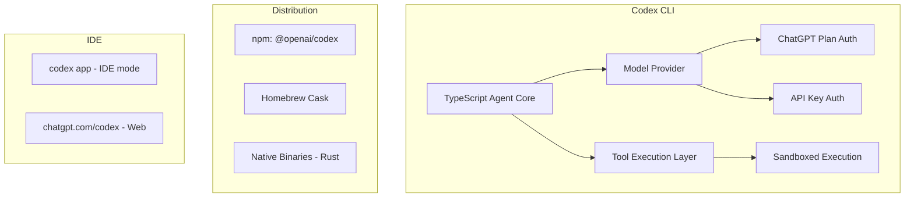

# OpenAI Codex

> **Lightweight coding agent that runs in your terminal — OpenAI's open-source CLI agent with sandboxed execution and multi-model support.**

| Field | Value |
|-------|-------|
| Category | ⚙️ Agent Harnesses / SDKs |
| Repository | [openai/codex](https://github.com/openai/codex) |
| Publisher | OpenAI (bigtech) |
| License | Apache-2.0 |
| Tech Stack | TypeScript monorepo (pnpm), Rust (native binaries), Nix (build), Bazel (build) |
| Maturity | 🟢 Production (GA Feb 2026) |
| Last Analyzed | 2026-03-08 |

---

## Burak's Notes

> *[Your personal observations, gut reactions, open questions, or ideas for how this tool connects to ongoing work. This section is yours — agents won't overwrite it.]*

---

## Relevance Scores

| Dimension | Score | Notes |
|-----------|-------|-------|
| **Relevance to our vision** | 5/10 | Open-source CLI agent with Apache-2.0 license. Architecturally comparable to Claude Code but with broader model access via ChatGPT plans. Potential Phase 3+ adapter candidate. |
| **Novelty** | 4/10 | Standard terminal agent architecture. The Rust-based native binary distribution and ChatGPT plan integration are differentiators, but the core agent pattern is well-understood. |
| **Actionable** | 3/10 | Apache-2.0 license means we can study the code. Potential adapter candidate when Paperclip's adapter pattern is implemented at Day 60+. Higher priority than Copilot SDK due to open-source nature. |

---

## Overview

OpenAI Codex CLI is a lightweight coding agent that runs in the terminal, analogous to Claude Code but built by OpenAI. It was open-sourced under Apache-2.0 and has accumulated 583 releases and 389 contributors — a very active project with significant engineering investment.

The key differentiator from Claude Code is its integration with ChatGPT plans — users can authenticate via their existing ChatGPT Plus, Pro, Team, Edu, or Enterprise subscription rather than needing a separate API key. This lowers the barrier to entry significantly. The CLI also supports standard API key authentication for more advanced usage.

The project uses a hybrid TypeScript + Rust architecture: the CLI application is TypeScript (via pnpm monorepo), but native binaries are built in Rust for cross-platform distribution (macOS ARM64/x86, Linux x86/ARM64). The build system uses both Nix (flake.nix) and Bazel (defs.bzl, rbe.bzl) — indicating enterprise-grade build infrastructure.

Codex can also run as an IDE integration (`codex app`) and has a web companion at chatgpt.com/codex for cloud-based execution.

---

## Technical Architecture

**Key architectural points:**
- **Monorepo:** pnpm workspace with multiple packages
- **Build:** Nix + Bazel (enterprise-grade, reproducible builds)
- **Distribution:** npm global install, Homebrew cask, native Rust binaries per platform
- **Auth:** ChatGPT plan sign-in (primary) or API key
- **IDE mode:** `codex app` for IDE integration
- **Cloud companion:** chatgpt.com/codex for browser-based execution

**Comparison with Claude Code and Pi Agent:**

| Dimension | Codex CLI | Claude Code | Pi Agent |
|-----------|-----------|-------------|----------|
| **License** | Apache-2.0 | Proprietary | MIT |
| **Models** | OpenAI models | Claude models only | 324+ models |
| **Auth** | ChatGPT plan or API key | Claude Max or API | Any provider |
| **Source** | Open-source | Closed-source | Open-source |
| **Extension system** | Limited (early) | MCP + Shell hooks | TypeScript extensions (25+ events) |
| **IDE integration** | `codex app` + web | VS Code extension | RPC mode for any IDE |
| **Contributors** | 389 | N/A (closed) | ~134 |

---

## Publisher Background

OpenAI is the company behind ChatGPT, GPT-4, and the leading commercial LLM platform. Codex CLI represents their entry into the terminal agent market, competing directly with Claude Code (Anthropic) and indirectly with Pi Agent (open-source). The 389 contributors and 583 releases indicate massive engineering investment.

The open-sourcing under Apache-2.0 is a strategic move — it provides an onramp to OpenAI's model ecosystem. Users who adopt Codex CLI become OpenAI model users via their ChatGPT subscriptions. This is the "open-source the agent, monetize the models" playbook.

Codex CLI also powers the Paperclip orchestration platform as one of its supported adapters (`codex-local`), validating its embeddability. T3 Code is built specifically as a GUI wrapper for Codex CLI.

---

## What's Valuable for Us

1. **Open-Source Agent Architecture Reference:** Apache-2.0 means we can study Codex's internals — how it handles tool execution, context management, session persistence. Useful reference when building our adapter abstraction layer at Day 60+.

2. **Adapter Candidate:** Paperclip already has a `codex-local` adapter, validating that Codex can be orchestrated externally. When we build our adapter interface, Codex is a credible second harness alongside Pi Agent.

3. **Rust Binary Distribution Pattern:** Their hybrid TS + Rust approach (TypeScript for agent logic, Rust for native binaries) is an interesting pattern if we ever need cross-platform distribution of our orchestrator.

4. **ChatGPT Plan Economics:** One subscription ($20-200/mo) covering both interactive and agent use is worth monitoring. If OpenAI's pricing or model quality surpasses Claude Max, this is the migration path.

---

## What's NOT Relevant

| Feature | Why Not |
|---------|---------|
| **OpenAI model lock-in** | We're Claude-first. Pi Agent (model-agnostic) is the preferred alternative if switching. |
| **ChatGPT plan auth** | Interesting for consumer users, not for our orchestrator which needs API-level control. |
| **Bazel/Nix build system** | Overengineered for our needs. We use simple shell scripts and pnpm. |
| **IDE mode / Web companion** | Terminal is our interface (Master Blueprint §8.9). |
| **Limited extension system** | Compared to Pi's 25+ event hooks and composable extensions, Codex's extension model is underdeveloped. |

The 4 existing Codex research documents in `research/` cover the broader Codex implications:
- [codex-research-finance-agent-migration.md](file:///Users/buraksmac/Desktop/code2/orchestrator/research/2026-03-06_110029_codex-research-finance-agent-migration.md)
- [codex-research-multi-business-system-blueprint.md](file:///Users/buraksmac/Desktop/code2/orchestrator/research/2026-03-06_110029_codex-research-multi-business-system-blueprint.md)
- [codex-research-phase2-architecture-principles.md](file:///Users/buraksmac/Desktop/code2/orchestrator/research/2026-03-06_110029_codex-research-phase2-architecture-principles.md)
- [codex-research-master-system-plan.md](file:///Users/buraksmac/Desktop/code2/orchestrator/research/2026-03-06_110713_codex-research-master-system-plan.md)

---

## Future Use Cases

- **Phase 1–2 (Days 1–60):** Not relevant. Stay with Claude Code per Master Blueprint.
- **Phase 3 (Days 60–90):** Evaluate as a potential second adapter alongside Pi Agent. Study its open-source internals for adapter design patterns.
- **Phase 4 (Days 90+):** If OpenAI models outperform Claude for specific task types, Codex becomes the adapter for GPT-routed tasks in a multi-model orchestrator.

---

## Key Takeaway

> **OpenAI Codex is the only open-source (Apache-2.0) terminal agent from a major AI lab — making it a credible Phase 3+ adapter candidate if we implement multi-harness support, though its OpenAI model lock-in and weaker extension system make Pi Agent the preferred alternative harness.**
