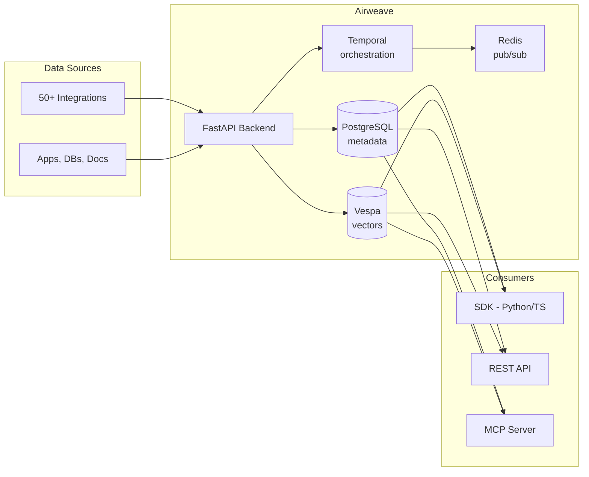

# Airweave

> **Open-source context retrieval layer for AI agents — connects to your apps, tools, and databases, syncs their data, and exposes it through a unified, LLM-friendly search interface.**

| Field | Value |
|-------|-------|
| Category | 🧠 Agent Memory & Context |
| Repository | [airweave-ai/airweave](https://github.com/airweave-ai/airweave) |
| Publisher | Airweave AI (startup) |
| License | MIT |
| Tech Stack | FastAPI (Python), PostgreSQL, Vespa (vectors), Temporal (orchestration), Redis (pub/sub), Docker/Kubernetes |
| Maturity | 🟢 Production |
| Last Analyzed | 2026-03-08 |

---

## Burak's Notes

> *[Your personal observations, gut reactions, open questions, or ideas for how this tool connects to ongoing work. This section is yours — agents won't overwrite it.]*

---

## Relevance Scores

| Dimension | Score | Notes |
|-----------|-------|-------|
| **Relevance to our vision** | 3/10 | Enterprise-grade retrieval layer with 50+ connectors. Overkill for Phase 1–3. Potential Phase 4+ consideration when cross-business context retrieval becomes a real need. |
| **Novelty** | 3/10 | Standard RAG/retrieval platform architecture (ingest → index → retrieve). No novel patterns beyond scale/polish. |
| **Actionable** | 2/10 | Nothing we can use now. Its complexity (Vespa + Temporal + Redis + PostgreSQL + Docker/K8s) conflicts with our "zero infrastructure" Phase 1 approach. |

---

## Overview

Airweave is shared retrieval infrastructure that sits between data sources and AI systems. It handles authentication, ingestion, syncing, indexing, and retrieval so teams don't rebuild pipelines for every agent or integration. The system supports 50+ integrations (apps, databases, documents) and exposes data through SDKs (Python, TypeScript), REST API, MCP, and native integrations with popular agent frameworks.

The core flow: connect your apps → Airweave syncs, indexes, and exposes data through a unified retrieval layer → agents query Airweave to retrieve relevant, grounded, up-to-date context.

This is enterprise-grade infrastructure designed for teams with many data sources and many agents needing shared context. For a solo operator with 2–3 agents reading from Notion and local files, it's massive overkill.

---

## Technical Architecture

**Tech Stack:**
- **Frontend:** React/TypeScript with ShadCN
- **Backend:** FastAPI (Python)
- **Databases:** PostgreSQL (metadata), Vespa (vector search)
- **Workers:** Temporal (orchestration), Redis (pub/sub)
- **Deployment:** Docker Compose (dev), Kubernetes (prod)

**Key capabilities:**
- 50+ connectors for data sources
- Continuous sync (not one-shot)
- MCP server for agent framework integration
- Python and TypeScript SDKs

---

## Publisher Background

Airweave AI is a startup focused on context retrieval infrastructure for AI agents. The project has 415 releases (very active development cadence), suggesting a well-funded team. The MIT license and active contributor base indicate a genuine open-source commitment. Based on the tech stack choices (Temporal, Vespa, K8s), the team has enterprise infrastructure experience.

---

## What's Valuable for Us

Very little at our current scale. The main value points are conceptual:

1. **Unified retrieval interface across data sources:** If we ever need to query across Notion, local files, git repos, and external services in a single agent request, Airweave's approach (unified search layer) is the pattern to follow.

2. **MCP server for retrieval:** Their MCP server implementation could be a reference if we build our own knowledge retrieval MCP server.

3. **Continuous sync vs. on-demand:** Their approach of keeping indexes continuously updated (rather than querying source systems on each agent request) is worth noting for Phase 4+ when latency of Notion MCP calls might become a bottleneck.

---

## What's NOT Relevant

| Feature | Why Not |
|---------|---------|
| **50+ connectors** | We have 2 data sources (Notion, local files). We don't need a connector framework. |
| **Vespa vector search** | We explicitly follow "no vector database" per Always-On Memory Agent validation and ADR-002. |
| **Temporal orchestration** | Massive infrastructure overhead. We use LaunchAgent + shell scripts. |
| **Redis pub/sub** | We use file-based events. Adding Redis is infrastructure we don't need. |
| **Docker/Kubernetes deployment** | "You are one person on one Mac. tmux + LaunchAgent is sufficient." (Master Blueprint §7) |
| **Enterprise multi-tenant** | Our federation model handles isolation differently (per-business-line repos, not a shared retrieval layer). |

---

## Future Use Cases

- **Phase 1–3:** Not relevant. Our data sources (Notion + local files) don't need a retrieval layer.
- **Phase 4 (Days 90+):** If cross-business-line context retrieval becomes a real need (e.g., "find all prior art across all client projects for this architecture pattern"), Airweave could be evaluated as an alternative to building custom retrieval.
- **Long-term:** If scaling to 10+ agents that need shared context across dozens of data sources, Airweave becomes a serious contender.

---

## Key Takeaway

> **Airweave is enterprise retrieval infrastructure that's massive overkill for Phase 1–3, but worth bookmarking for Phase 4+ if cross-business context retrieval becomes a real bottleneck — until then, Notion MCP + local files suffice.**
