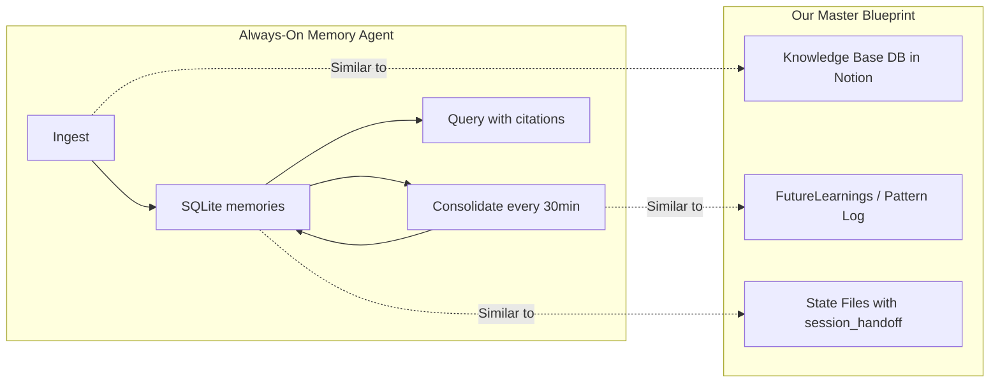

# Always-On Memory Agent: Fit Analysis

**Date:** 2026-03-07
**Project:** [GoogleCloudPlatform/generative-ai — always-on-memory-agent](https://github.com/GoogleCloudPlatform/generative-ai/tree/main/gemini/agents/always-on-memory-agent)

---

## What It Is

A lightweight, always-running memory daemon built with **Google ADK** + **Gemini 3.1 Flash-Lite**. Three specialist sub-agents behind an orchestrator:

| Agent | Role | Tools |
|-------|------|-------|
| **IngestAgent** | Extracts structured info from multimodal input (text, images, audio, video, PDFs) | `store_memory` |
| **ConsolidateAgent** | Runs on a timer (every 30 min), finds cross-cutting patterns across memories | `read_unconsolidated_memories`, `store_consolidation` |
| **QueryAgent** | Synthesizes answers from stored memories with source citations | `read_all_memories`, `read_consolidation_history` |
| **Orchestrator** | Routes to the right sub-agent | `get_memory_stats` + sub-agents |

**Storage:** SQLite (`memory.db`) with three tables: `memories`, `consolidations`, `processed_files`.

**Input channels:** File watcher (`./inbox/`), HTTP API (`/ingest`), Streamlit dashboard.

**Key design choice:** "No vector database. No embeddings. Just an LLM that reads, thinks, and writes structured memory." Uses the cheapest/fastest model (Flash-Lite) because it runs 24/7.

---

## How It Maps to Our Architecture

### Direct Alignment Points



| Their Concept | Our Equivalent | Status in Our System |
|---------------|---------------|---------------------|
| `IngestAgent` (extract structured info) | Knowledge Base DB entries in Notion | **Planned** (Phase 2, Week 1-2) |
| `ConsolidateAgent` (find patterns periodically) | Pattern Log + FutureLearnings self-consolidation | **Not implemented** — this is the gap |
| `QueryAgent` (answer from memory) | Agent context assembly from CLAUDE.md + Skills | **Working** (Tier 0/1/2 system) |
| SQLite persistent store | JSON state files → SQLite graduation path | **Phase 1** (JSON) → **Phase 3** (SQLite, Day 60+) |
| Timer-based background processing | LaunchAgent scheduler (Finance Agent: daily `/check`) | **Working** for Finance Agent |
| Multimodal ingestion | Not in scope | N/A |

### Where It Validates Our Research

1. **"LLM that reads, thinks, and writes structured memory" = our Governing Principle #1.** The orchestration/memory layer is the compounding asset. They validate that the memory infrastructure, not the model, is what matters.

2. **Consolidation-as-sleep pattern directly maps to our knowledge compounding research.** Our [knowledge compounding doc](file:///Users/buraksmac/Desktop/code2/orchestrator/research/2026-03-05_PHASE2_research-knowledge-compounding-transfer.md) covers MUSE (experience accumulation), CER (experience replay), and A-Mem (self-organizing memory). The Always-On Memory Agent is a **minimal viable implementation** of these patterns — periodic consolidation that finds connections.

3. **SQLite for memory, not vector DB.** Aligns with our ADR-002 State Graduation Path: JSON → SQLite → (only if needed) something heavier. They skip embeddings entirely — structured LLM extraction is sufficient for their use case.

4. **Cheap model for background ops.** Matches our tiered model strategy: Opus for orchestration decisions, Sonnet for coding, and now evidence that Flash-Lite is viable for memory maintenance.

---

## What's Interesting for Us

### 1. The Consolidation Loop (Most Valuable Pattern)

> [!IMPORTANT]
> This is the one thing we should seriously consider adopting.

Our Knowledge Base entries (Notion) and Pattern Log are **append-only** — we never go back and consolidate. The Always-On Memory Agent's 30-minute consolidation cycle that:

- Reviews unconsolidated memories
- Finds connections between them
- Generates cross-cutting insights
- Compresses related information

...is exactly the "brain during sleep" pattern from MUSE research that we cataloged but haven't implemented. A **scheduled Knowledge Base consolidation job** (via LaunchAgent) that reads recent entries, finds patterns, and writes synthesized insights back would be a natural fit for our system.

### 2. The ADK Multi-Agent Pattern

Their orchestrator → sub-agent architecture is cleanly designed but basic. Each sub-agent has narrow tools and a focused system prompt. This validates our **"specialization through context, not models"** principle — same Flash-Lite model, different prompts, different tools.

### 3. Importance Scoring on Ingestion

Each memory gets an `importance` score (0.0-1.0) at ingest time. We don't do this — our Knowledge Base entries are flat. Adding importance scoring could help with context budget allocation when loading relevant knowledge.

---

## What's NOT Relevant to Us

| Feature | Why Not |
|---------|---------|
| **Multimodal ingestion** (images, audio, video) | Our domain is code/business context, not media processing |
| **File watcher inbox pattern** | We use Notion MCP, CLI commands, and structured events — not file drops |
| **Streamlit dashboard** | We have Notion dashboards and terminal; Streamlit adds tooling we don't need |
| **Single-agent memory store** | We need *federated* memory per business line with cross-line consolidation — their single-DB design doesn't address compliance isolation (ADR-001) |
| **No authentication/multi-tenant** | We need per-business-line isolation (government client data vs. lead gen data) |

---

## Verdict

```
Relevance:  ██████░░░░ 6/10
Novelty:    ████░░░░░░ 4/10
Actionable: ██████░░░░ 6/10
```

**It's a clean, minimal reference implementation of one slice of what we've already researched extensively.** It validates patterns we've documented (tiered memory, consolidation, structured extraction over embeddings) but doesn't push beyond them.

### Concrete Takeaway

**One actionable idea:** A **scheduled consolidation agent** that runs nightly (via LaunchAgent), reads the last N Knowledge Base entries from Notion, finds cross-cutting patterns, and writes synthesized insights back as new entries. This would be our first implementation of the "knowledge compounding through consolidation" pattern that research says is the #1 untapped leverage point.

This maps to our roadmap as a **Phase 2 item** (Days 4-60), specifically within the "Build Notion meta-layer" work. It requires:
- Knowledge Base DB populated with ≥20 entries
- A simple Python script or Claude Code agent with Notion MCP access
- A LaunchAgent schedule (daily or every 12 hours)
- A consolidation prompt that finds connections between entries

**Total effort:** ~1 day. Zero new infrastructure.
