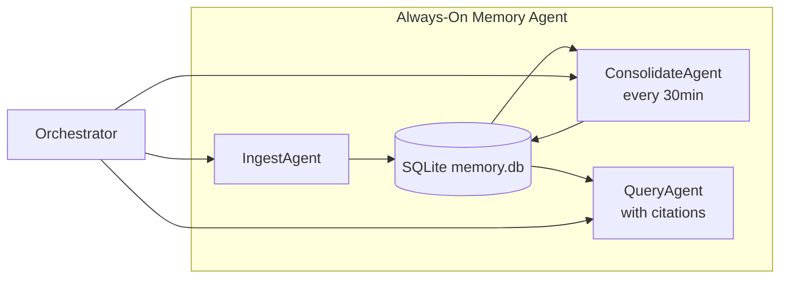

# Always-On Memory Agent

> **A lightweight, always-running memory daemon built with Google ADK + Gemini Flash-Lite that extracts, consolidates, and queries structured memories from multimodal input.**

| Field | Value |
|-------|-------|
| Category | 🧠 Agent Memory & Context |
| Repository | [GoogleCloudPlatform/generative-ai/always-on-memory-agent](https://github.com/GoogleCloudPlatform/generative-ai/tree/main/gemini/agents/always-on-memory-agent) |
| Publisher | Google Cloud Platform (bigtech) |
| License | Apache-2.0 |
| Tech Stack | Python, Google ADK, Gemini 3.1 Flash-Lite, SQLite |
| Maturity | 🟡 Early |
| Last Analyzed | 2026-03-07 |

---

## Burak's Notes

> *[Your personal observations, gut reactions, open questions, or ideas for how this tool connects to ongoing work. This section is yours — agents won't overwrite it.]*

---

## Relevance Scores

| Dimension | Score | Notes |
|-----------|-------|-------|
| **Relevance to our vision** | 6/10 | Consolidation-as-sleep pattern maps directly to our knowledge compounding research (MUSE, CER, A-Mem). Validates Governing Principle #1 — the memory layer is the compounding asset. |
| **Novelty** | 4/10 | Clean implementation of patterns we've already documented in Phase 2 research. No new theoretical ground. |
| **Actionable** | 6/10 | The consolidation loop is directly implementable as a LaunchAgent-scheduled job over our Knowledge Base. ~1 day effort. |

---

## Overview

A lightweight memory daemon that uses three specialist sub-agents behind an orchestrator to process multimodal input into structured, queryable memories. The system runs 24/7 using the cheapest available model (Gemini Flash-Lite) and stores everything in a single SQLite database.

The key architectural insight is "No vector database. No embeddings. Just an LLM that reads, thinks, and writes structured memory." The system uses structured LLM extraction rather than embedding-based retrieval, and includes a periodic consolidation cycle that reviews unconsolidated memories to find cross-cutting patterns — a "brain during sleep" model.

Input channels include a file watcher (`./inbox/`), HTTP API (`/ingest`), and a Streamlit dashboard. Each memory gets an importance score (0.0–1.0) at ingest time.

---

## Technical Architecture

**Sub-agent breakdown:**

| Agent | Role | Tools |
|-------|------|-------|
| **IngestAgent** | Extracts structured info from multimodal input (text, images, audio, video, PDFs) | `store_memory` |
| **ConsolidateAgent** | Runs on a timer (every 30 min), finds cross-cutting patterns across memories | `read_unconsolidated_memories`, `store_consolidation` |
| **QueryAgent** | Synthesizes answers from stored memories with source citations | `read_all_memories`, `read_consolidation_history` |
| **Orchestrator** | Routes to the right sub-agent | `get_memory_stats` + sub-agents |

**Storage:** SQLite (`memory.db`) with three tables: `memories`, `consolidations`, `processed_files`.

---

## Publisher Background

Built by Google Cloud Platform's Generative AI team as a reference implementation within their broader `generative-ai` sample repository. This is a demonstration/educational project, not a supported product. The ADK (Agent Development Kit) is Google's framework for building multi-agent systems with Gemini models.

---

## What's Valuable for Us

1. **The Consolidation Loop (Most Valuable Pattern):** Our Knowledge Base entries (Notion) and Pattern Log are append-only — we never go back and consolidate. The 30-minute cycle that reviews unconsolidated memories, finds connections, generates cross-cutting insights, and compresses related information is exactly the "brain during sleep" pattern from MUSE research that we cataloged but haven't implemented. A **scheduled Knowledge Base consolidation job** (via LaunchAgent) would be a natural Phase 2 addition.

2. **"LLM that reads, thinks, writes structured memory" = our Governing Principle #1.** They validate that the memory infrastructure, not the model, is what matters.

3. **SQLite for memory, not vector DB.** Aligns with our ADR-002 State Graduation Path: JSON → SQLite → (only if needed) something heavier.

4. **Cheap model for background ops.** Matches our tiered model strategy: Opus for orchestration, Sonnet for coding, Flash-Lite for memory maintenance.

5. **Importance scoring on ingestion.** Each memory gets a 0.0–1.0 score. We don't do this — our Knowledge Base entries are flat. Adding importance scoring could help with context budget allocation.

---

## What's NOT Relevant

| Feature | Why Not |
|---------|---------|
| **Multimodal ingestion** (images, audio, video) | Our domain is code/business context, not media processing |
| **File watcher inbox pattern** | We use Notion MCP, CLI commands, and structured events — not file drops |
| **Streamlit dashboard** | We have Notion dashboards and terminal; Streamlit adds tooling we don't need |
| **Single-agent memory store** | We need *federated* memory per business line with cross-line consolidation — their single-DB design doesn't address compliance isolation (ADR-001) |
| **No authentication/multi-tenant** | We need per-business-line isolation (government client data vs. lead gen data) |

---

## Future Use Cases

- **Phase 2 (Days 4–60):** Implement a scheduled consolidation agent as a LaunchAgent job that reads recent Knowledge Base entries from Notion, finds patterns, and writes synthesized insights back. Requires ≥20 KB entries populated first. ~1 day effort.
- **Phase 3 (Days 60–90):** If SQLite graduation happens, the consolidation pattern could expand to cross-business-line pattern detection.
- **Phase 4 (Days 90+):** Not applicable — the pattern is simple enough to implement in-house.

---

## Key Takeaway

> **The consolidation-as-sleep pattern — periodically reviewing accumulated knowledge to find cross-cutting patterns — is the single most actionable idea from this tool: a nightly LaunchAgent job that consolidates our Knowledge Base would be our first implementation of the knowledge compounding research.**
