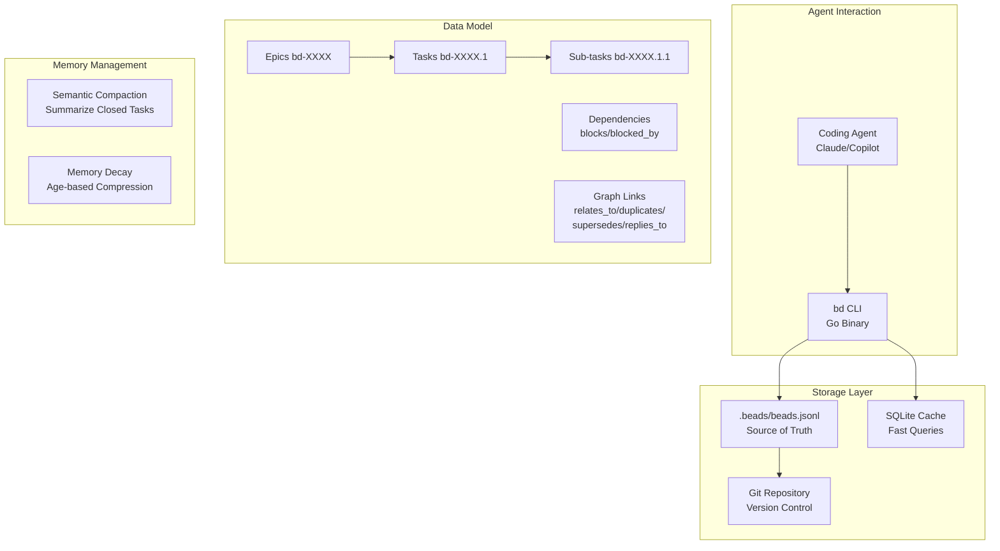

# Beads

> **A memory upgrade for your coding agent — persistent, dependency-aware graph-based issue tracker optimized for AI agents.**

| Field | Value |
|-------|-------|
| Category | 🧠 Agent Memory & Context |
| Repository | [steveyegge/beads](https://github.com/steveyegge/beads) |
| GitHub Stars | 18,500 (as of 2026-03-08) |
| Publisher | Steve Yegge (solo / independent) |
| License | MIT |
| Tech Stack | Go (92.9%), Python (4.4%), Dolt (versioned SQL), JSONL storage, SQLite cache |
| Maturity | 🟡 Early (rapidly iterating, v0.59.0) |
| Last Analyzed | 2026-03-08 |

---

## Burak's Notes

> *[Your personal observations, gut reactions, open questions, or ideas for how this tool connects to ongoing work. This section is yours — agents won't overwrite it.]*

---

## Relevance Scores

| Dimension | Score | Notes |
|-----------|-------|-------|
| **Relevance to our vision** | 7/10 | Beads solves the exact "50 First Dates" problem we face — agents losing context between sessions. The dependency-aware task graph with semantic compaction maps directly to our orchestrator's need to track multi-step work across sessions. The hash-based IDs preventing merge collisions in multi-agent workflows is exactly our concurrency pattern. |
| **Novelty** | 8/10 | This is genuinely new. Not another RAG/vector/graph memory system — it's a structured, agent-native issue tracker that doubles as working memory. The semantic compaction (summarizing closed tasks to save context window) is the "consolidation-as-sleep" pattern implemented as a first-class feature. Steve Yegge's framing of the problem is sharper than anything else in our research. |
| **Actionable** | 7/10 | Single Go binary, zero infrastructure, git-backed storage, Claude plugin included. Could install and trial today with our orchestrator agents. The `bd ready` command (list unblocked tasks) is directly useful for our agent work assignment. Main question: does it complement or compete with our orchestrator state files? |

---

## Overview

Beads is a persistent, structured memory system for coding agents created by Steve Yegge (ex-Google, ex-Amazon, ex-Sourcegraph, 30+ years in tech). It replaces the typical mess of markdown TODO files and ad-hoc plans with a dependency-aware task graph stored as JSONL in git, cached locally in SQLite for fast queries. The key insight: agents don't need a "memory database" — they need a structured issue tracker that's optimized for their consumption (JSON output, hash-based IDs, dependency tracking, auto-ready task detection).

The system solves what Yegge calls the "50 First Dates" problem: every new agent session starts with amnesia. Beads persists the task graph in `.beads/beads.jsonl` within your project repo, so when a new session starts, the agent can run `bd ready` to see what's unblocked and continue where the previous session left off. Semantic compaction automatically summarizes closed tasks to keep the context window manageable — old completed work gets compressed into summaries while active work stays detailed.

The architecture is deliberately minimal: a single Go binary (the `bd` CLI), JSONL files in git (no database server), and a local SQLite cache for fast queries. Hash-based IDs (like `bd-a1b2`) prevent merge conflicts when multiple agents work on the same repo across different branches. The hierarchical structure (Epic → Task → Sub-task with IDs like `bd-a3f8.1.1`) and graph links (`relates_to`, `duplicates`, `supersedes`, `replies_to`) give agents the structure they need for long-horizon planning.

---

## Technical Architecture

**Core data model:**
- **Beads:** Individual task/issue units with hash-based IDs (`bd-a1b2`)
- **Hierarchy:** Epic → Task → Sub-task (e.g., `bd-a3f8.1.1`)
- **Dependencies:** Parent-child relationships and blocking connections
- **Graph links:** `relates_to`, `duplicates`, `supersedes`, `replies_to`
- **Messages:** Separate issue type with threading and ephemeral lifecycle

**Storage:**
- Primary: `.beads/beads.jsonl` — JSONL file stored in git
- Cache: Local SQLite for fast queries
- Backend: Dolt (versioned SQL) for cell-level merge in multi-branch scenarios
- All data version-controlled via git

**Key CLI commands:**
- `bd init` — Initialize beads in a project
- `bd ready` — List unblocked, actionable tasks
- `bd create "Title" -p 0` — Create a prioritized task
- `bd update <id> --claim` — Atomically claim a task (agent coordination)
- `bd dep add <child> <parent>` — Create dependency links
- `bd show <id>` — View task details and history
- `bd init --stealth` / `bd init --contributor` — Initialization variants

**Agent integrations:**
- Claude plugin (`.claude-plugin` directory)
- GitHub Copilot integration
- Community-built UIs and editor extensions (tracked in `COMMUNITY_TOOLS.md`)

---

## Publisher Background

Steve Yegge is a legendary software engineer and technical writer with 40 years of coding experience. Ex-Geoworks, ex-Amazon (where he wrote the famous "platform rant" about Jeff Bezos's API mandate), ex-Google (where he wrote influential internal essays that leaked), ex-Grab, and ex-Sourcegraph (Head of Engineering, makers of Amp/Cody). His blog posts and rants have shaped how the industry thinks about platforms, APIs, and developer experience for over two decades.

Beads went from idea to 1,000+ GitHub stars in 6 days. Now at 18.5K stars with tens of thousands of daily users. The project is solo-maintained but has a Rust port by community contributor @doodlestein. Yegge is actively iterating (v0.59.0 with frequent releases) and writing extensively about agent memory patterns on Medium.

---

## What's Valuable for Us

1. **Direct replacement for ad-hoc task tracking:** Our orchestrator currently tracks tasks in `_bmad/orchestrator-state.json` and `_bmad/orchestrator-teams-state.json`. Beads could replace or complement these with a more structured, agent-native format. The `bd ready` command directly maps to our "what should the next agent work on?" decision.

2. **Semantic compaction = consolidation-as-sleep:** Beads automatically summarizes closed tasks to preserve context window space. This is exactly our "consolidation-as-sleep" pattern, but implemented as a first-class feature rather than a manual step. Study their compaction algorithm.

3. **Hash-based IDs for multi-agent coordination:** Our orchestrator spawns multiple agents that sometimes reference the same tasks. Beads' hash-based IDs (`bd-a1b2`) prevent the merge conflicts we'd get with sequential integer IDs across branches. This is directly useful if we adopt Beads for cross-agent task coordination.

4. **Dependency graph for work ordering:** The blocking/blocked_by relationships let agents automatically determine what's actionable without our orchestrator having to compute it. This could simplify our orchestrator's task assignment logic.

5. **Git-backed, zero-infrastructure:** JSONL in git, SQLite cache, single Go binary. Perfectly aligned with our zero-infra, files-in-git philosophy. No databases, no servers, no Docker.

6. **Claude plugin included:** Native integration with Claude Code means our agents could use Beads immediately without custom tooling.

---

## What's NOT Relevant

| Feature | Why Not |
|---------|---------|
| **Dolt dependency** | Beads uses Dolt for cell-level merge, but for single-branch usage (our case), the JSONL + SQLite path works without Dolt. Still, it's an indirect dependency to be aware of. |
| **GitHub Copilot integration** | We don't use Copilot. Claude Code only. |
| **Issue tracker framing** | Beads is framed as a "TODO/issue tracker" but our orchestrator already has task management. The memory and dependency aspects are what matter, not replacing our task tracking. |
| **Community UIs** | We're terminal-first. GUI tools for Beads are irrelevant. |

---

## Future Use Cases

- **Phase 1-3 (NOW):** Trial Beads alongside our orchestrator state files. Key experiment: have orchestrator agents use `bd create` for sub-tasks and `bd ready` for work discovery. If it reduces our state management complexity, adopt as the task tracking layer.
- **Phase 3 (Days 60-90):** If validated, Beads could become the universal task memory across all business lines — each repo gets its own `.beads/` directory, and agents across business lines use the same CLI for task management.
- **Phase 4 (Days 90+):** Multi-agent coordination at scale. Beads' hash-based IDs and atomic claiming (`bd update --claim`) become essential for preventing duplicate work when many agents are active.

---

## Key Takeaway

> **Beads is the most aligned tool to our philosophy in this entire batch — zero-infrastructure, git-backed, agent-native task memory with dependency graphs and semantic compaction, built by Steve Yegge with a crystal-clear understanding of the "50 First Dates" problem — trial immediately alongside our orchestrator state files.**
