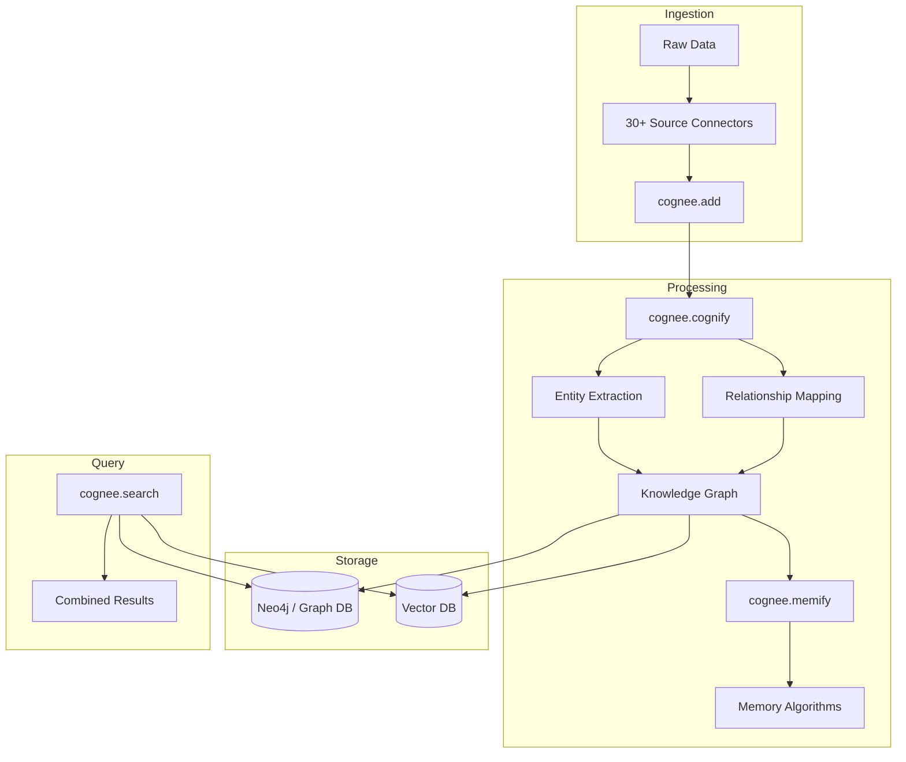

# Cognee

> **Knowledge Engine for AI Agent Memory — transforms raw data into persistent knowledge graphs with vector + graph hybrid search in 6 lines of code.**

| Field | Value |
|-------|-------|
| Category | 🧠 Agent Memory & Context |
| Repository | [topoteretes/cognee](https://github.com/topoteretes/cognee) |
| GitHub Stars | 13,000 (as of 2026-03-08) |
| Publisher | Cognee Inc. / topoteretes (startup, Berlin-based) |
| License | Apache-2.0 |
| Tech Stack | Python (93%), TypeScript (6.5%), Neo4j, vector DBs, OpenAI/Ollama/Claude integrations |
| Maturity | 🟢 Production |
| Last Analyzed | 2026-03-08 |

---

## Burak's Notes

> *[Your personal observations, gut reactions, open questions, or ideas for how this tool connects to ongoing work. This section is yours — agents won't overwrite it.]*

---

## Relevance Scores

| Dimension | Score | Notes |
|-----------|-------|-------|
| **Relevance to our vision** | 5/10 | Knowledge graph approach is interesting for Phase 3+ multi-business memory, but requires Neo4j + vector DB infrastructure that violates our zero-infra principle. Not solving an immediate problem. |
| **Novelty** | 6/10 | The dual-layer memory model (session vs. permanent) and automatic knowledge graph construction from unstructured data is a step beyond simple embedding-based retrieval. But we've already validated a no-vector-DB pattern with Always-On Memory Agent. |
| **Actionable** | 3/10 | Heavy Python infrastructure with Neo4j dependency. Can't adopt patterns directly into our TypeScript/shell/Claude-first stack. The `add → cognify → memify → search` pipeline is elegant but requires standing up graph + vector infra. |

---

## Overview

Cognee is a knowledge engine that builds persistent memory for AI agents by automatically constructing knowledge graphs from raw data. The core workflow is four operations: `cognee.add()` ingests data (text, files, images, audio transcriptions), `cognee.cognify()` generates a knowledge graph with entity extraction and relationship mapping, `cognee.memify()` applies memory algorithms (consolidation, decay, reinforcement), and `cognee.search()` queries the graph using combined vector + graph traversal.

The architecture separates memory into two distinct layers. Session memory operates as short-term working memory — it loads relevant embeddings and graph fragments into runtime context for fast reasoning during an active agent session. Permanent memory stores long-term knowledge artifacts including user data, interaction traces, external documents, and derived relationships that are continuously cross-connected inside the graph.

Cognee has moved from experimental to production-grade: pipeline volume grew from ~2,000 runs to over 1 million in 2025 (500x), and it's running live in 70+ companies including Bayer and the University of Wyoming. The project graduated from the GitHub Secure Open Source Program.

---

## Technical Architecture

**Core components:**
- **Graph Database:** Neo4j for entity-relationship storage and traversal
- **Vector Store:** Pluggable vector DB for semantic similarity search
- **Pipeline Engine:** Async Python pipelines for data transformation (30+ data source connectors)
- **LLM Integration:** OpenAI, Claude, Ollama for entity extraction and reasoning
- **MCP Server:** Model Context Protocol integration for agent framework compatibility
- **CLI + UI:** `cognee-cli` and local web UI for management

**Data model:** Documents are decomposed into entities and relationships, stored as graph nodes and edges with embedding vectors attached. The graph enables multi-hop reasoning ("find all entities related to X that also connect to Y") while vectors handle fuzzy semantic matching.

---

## Publisher Background

Cognee Inc. was founded by Boris Arzentar (CTO) and Vasilije Markovic (CEO). The company is Berlin-based and has raised $9.09M total across 2 rounds — most recently a $7.5M Seed in February 2026 led by Pebblebed with 42CAP participating. The project has 118 contributors, 5,894 commits, and graduated from GitHub's Secure Open Source Program. Not YC-backed. The team has strong graph database and data engineering backgrounds.

---

## What's Valuable for Us

1. **Session vs. Permanent memory separation:** This two-layer model maps well to our Always-On Memory Agent architecture. Their "session memory" = our agent context loading, their "permanent memory" = our consolidated memory files. Worth studying their consolidation triggers.

2. **Memory algorithms (memify):** The concept of applying algorithmic post-processing to raw knowledge (consolidation, decay, reinforcement) validates our "consolidation-as-sleep" pattern. Their specific algorithm choices could inform our next iteration.

3. **MCP server implementation:** Cognee exposes memory through MCP, which aligns with our tool-based integration approach. Reference implementation for building our own memory MCP if we ever need structured retrieval beyond file-based context.

4. **Knowledge graph for cross-business reasoning:** In Phase 4+, if we need to answer "what patterns from client A's project apply to client B's problem," a graph structure would be the right primitive. Cognee's entity extraction pipeline is the reference implementation.

---

## What's NOT Relevant

| Feature | Why Not |
|---------|---------|
| **Neo4j dependency** | Standing up a graph database violates our zero-infrastructure Phase 1-3 approach. We're one person on one Mac. |
| **Vector DB requirement** | Explicitly conflicts with our validated no-vector-DB approach (Always-On Memory Agent with consolidation). |
| **Python-first stack** | Our stack is TypeScript/shell/Claude-first. Python infra adds operational complexity. |
| **30+ data source connectors** | We have Notion + local files. Don't need a connector framework. |
| **Enterprise scale (70+ companies)** | Their scaling concerns (millions of pipeline runs) are not our concerns. |

---

## Future Use Cases

- **Phase 1-3:** Not relevant. Our file-based memory consolidation pattern is simpler and sufficient.
- **Phase 4 (Days 90+):** If cross-business-line knowledge retrieval becomes a real need ("find all architecture decisions across all client projects"), Cognee's graph approach becomes interesting. The automatic entity extraction from unstructured text is genuinely useful at scale.
- **Long-term:** If we ever build a knowledge base that needs multi-hop reasoning (not just retrieval), Cognee's graph + vector hybrid is the most mature OSS option.

---

## Key Takeaway

> **Cognee is the most production-proven knowledge graph memory engine for agents, but its Neo4j + vector DB infrastructure requirements make it overkill for our file-based, zero-infra approach — bookmark for Phase 4+ when cross-business knowledge graph reasoning becomes a real need.**
