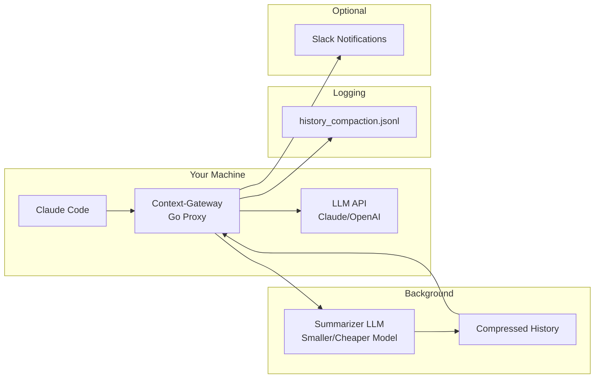

# Context-Gateway (Compresr)

> **An agentic proxy that enhances any AI agent workflow with instant history compaction and context optimization tools.**

| Field | Value |
|-------|-------|
| Category | 🧠 Agent Memory & Context |
| Repository | [Compresr-ai/Context-Gateway](https://github.com/Compresr-ai/Context-Gateway) |
| GitHub Stars | 174 (as of 2026-03-08) |
| Publisher | Compresr (startup, YC W26) |
| License | Apache-2.0 |
| Tech Stack | Go (96.2%), Shell, TypeScript, JSONL logging |
| Maturity | 🟡 Early |
| Last Analyzed | 2026-03-08 |

---

## Burak's Notes

> *[Your personal observations, gut reactions, open questions, or ideas for how this tool connects to ongoing work. This section is yours — agents won't overwrite it.]*

---

## Relevance Scores

| Dimension | Score | Notes |
|-----------|-------|-------|
| **Relevance to our vision** | 7/10 | Context compression is a real problem we face daily with Claude Code sessions. Long orchestrator conversations burn context windows and degrade quality. A transparent proxy that compresses history in the background directly solves our "start new sessions often" workaround. |
| **Novelty** | 7/10 | The "agentic proxy" pattern — sitting between agent and LLM API to transparently compress — is architecturally novel vs. the typical RAG/vector approach. Using smaller LLMs to compress inputs for larger ones is a clever cost-optimization primitive. |
| **Actionable** | 6/10 | Go binary, supports Claude Code natively, configurable threshold triggers. Could potentially trial this week with our orchestrator sessions. The 75% context threshold trigger is a sensible default. Main concern: does compression lose critical orchestrator state? |

---

## Overview

Context-Gateway is a transparent proxy that sits between your AI coding agent (Claude Code, Cursor, OpenClaw) and the LLM API. When conversations approach context limits (default 75% threshold), it automatically compresses conversation history in the background using a smaller, cheaper LLM — so by the time you hit the limit, a compressed summary is ready to swap in without any user-visible delay.

This solves the "50 First Dates" problem from a different angle than memory systems like Mem0 or Letta. Instead of building persistent memory across sessions, Context-Gateway extends the useful life of a single session by compressing its history. The approach is pragmatic: no databases, no vector stores, no graph engines — just a proxy that rewrites conversation history on the fly.

Compresr (YC W26) is the company behind it, founded by EPFL PhD researchers specializing in LLM context compression. Their academic paper "Cmprsr: Abstractive Token-Level Question-Agnostic Prompt Compressor" provides the theoretical foundation. The proxy is their open-source reference implementation while the company builds a commercial compression SDK for LLM pipelines.

---

## Technical Architecture

**Core mechanism:**
1. Proxy intercepts all agent-to-LLM traffic
2. Monitors context window usage against configurable threshold (default 75%)
3. When threshold approached, background task sends conversation history to a smaller summarizer LLM
4. Summarizer produces compressed version of history
5. On next request exceeding threshold, compressed history replaces original
6. All compaction events logged to `logs/history_compaction.jsonl`

**Key configuration:**
- Summarizer model selection (use a cheap/fast model for compression)
- Threshold percentage for triggering compression
- Agent-specific configurations (Claude Code, Cursor, OpenClaw, custom)
- Optional Slack notifications on compaction events

**Infrastructure requirements:** Minimal — single Go binary, no databases, no external services except the summarizer LLM API.

---

## Publisher Background

Compresr was founded by Ivan Zakazov (CEO, EPFL PhD researching LLM context compression), Kamel Charaf (COO, EPFL DLab + Bell Labs + AXA), Oussama Gabouj, and Berke Argin. Part of Y Combinator W26 batch. The team has serious academic credentials in prompt compression — Ivan's published research on abstractive token-level compression provides the theoretical backbone. Early stage (7 contributors, 174 stars), but YC backing and academic depth signal credibility. The company's commercial angle is a compression SDK claiming 100x compression ratios for LLM pipelines.

---

## What's Valuable for Us

1. **Direct applicability to our orchestrator sessions:** Our L-Thread Orchestrator conversations grow long fast — spawning agents, reading state, processing results. Context-Gateway could extend session life without our current "start fresh sessions often" workaround. This is the most immediately useful tool in this batch.

2. **Zero-infrastructure pattern:** Go binary proxy, no databases, no vector stores. Aligns perfectly with our zero-infra principle. This is how we build things.

3. **Background compression pattern:** The idea of pre-computing summaries before they're needed (background compression) is applicable beyond this tool. We could apply this pattern to our orchestrator state files — pre-summarize completed work so it's ready when the next session starts.

4. **JSONL activity logging:** Their approach of logging all compaction events to JSONL is a lightweight observability pattern we should adopt for our orchestrator state transitions.

5. **Cost optimization primitive:** Using a smaller LLM to compress context for a larger LLM is a "70/30 deterministic/LLM split" pattern — deterministic routing of compression to the cheapest capable model.

---

## What's NOT Relevant

| Feature | Why Not |
|---------|---------|
| **Cursor integration** | We don't use Cursor. Claude Code only. |
| **Commercial SDK** | We don't build LLM pipelines that need prompt compression at API level. |
| **Slack notifications** | Nice-to-have but not essential. We monitor via tmux. |

The "NOT relevant" list is short — this tool is well-aligned with our approach.

---

## Future Use Cases

- **Phase 1-3 (NOW):** Trial immediately with Claude Code orchestrator sessions. If compression preserves orchestrator state fidelity, this becomes a daily tool. Test with a real orchestration run and verify compressed context retains agent spawn history, state references, and task progress.
- **Phase 3 (Days 60-90):** If validated, integrate into our tmux-based session management. Auto-start Context-Gateway as part of orchestrator session initialization.
- **Phase 4 (Days 90+):** The background compression pattern could be generalized to our cross-business memory consolidation — pre-compress completed project contexts for archival.

---

## Key Takeaway

> **Context-Gateway is the most immediately actionable tool in this batch — a zero-infrastructure Go proxy that transparently compresses Claude Code conversation history in the background, directly solving our context window exhaustion problem without any vector DBs or memory frameworks.**
