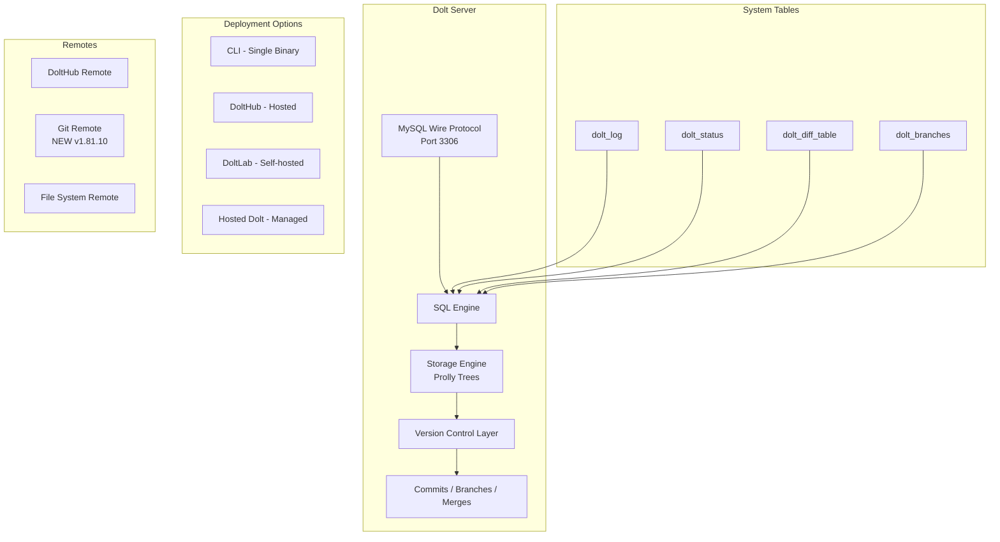

# Dolt

> **Dolt — Git for Data. A SQL database you can fork, clone, branch, merge, push and pull just like a Git repository.**

| Field | Value |
|-------|-------|
| Category | 🧠 Agent Memory & Context |
| Repository | [dolthub/dolt](https://github.com/dolthub/dolt) |
| GitHub Stars | 20,600 (as of 2026-03-08) |
| Publisher | DoltHub (startup, Santa Monica) |
| License | Apache-2.0 |
| Tech Stack | Go, MySQL-compatible wire protocol, Protocol Buffers, Docker |
| Maturity | 🟢 Production |
| Last Analyzed | 2026-03-08 |

---

## Burak's Notes

> *[Your personal observations, gut reactions, open questions, or ideas for how this tool connects to ongoing work. This section is yours — agents won't overwrite it.]*

---

## Relevance Scores

| Dimension | Score | Notes |
|-----------|-------|-------|
| **Relevance to our vision** | 4/10 | Interesting as a versioned state primitive, but we don't need a SQL database for agent state. Our JSON state files in git already give us versioning, branching, and diffing. Dolt solves the "git for structured data" problem — we don't have that problem yet. |
| **Novelty** | 5/10 | Git semantics applied to SQL data is a genuinely novel primitive. The cell-level merge and `dolt_diff_<table>` system tables are clever. But for our use case, git + JSON files achieves the same outcome with zero new dependencies. |
| **Actionable** | 3/10 | Would require replacing our file-based state management with a SQL database. That's a step backward in simplicity. The Go binary is lightweight, but adding MySQL-protocol infra is still unnecessary overhead for our scale. |

---

## Overview

Dolt is a SQL database with built-in version control — every table change is tracked with Git-like commits, branches, merges, and diffs. You connect to it using any MySQL client (it speaks the MySQL wire protocol) and use standard SQL for reads and writes, while version control operations are exposed through system tables (`dolt_log`, `dolt_status`, `dolt_diff_<tablename>`) and stored procedures. It's a single ~103MB Go binary that includes the database engine, CLI, and SQL server.

The core value proposition for agent systems: if your agents produce structured data (state, decisions, knowledge), Dolt gives you full auditability with commit history, the ability to branch for experimentation ("what if the agent took a different path?"), and cell-level merge for multi-agent concurrent writes without conflicts. This makes it a primitive for agent state versioning — every state transition is a commit, every agent gets a branch, and merging agent work products follows git semantics.

In February 2026, Dolt added native Git remote support (v1.81.10), meaning Dolt databases can live alongside your source code in Git remotes. This significantly lowers the barrier — your versioned database is just another thing in your git workflow.

---

## Technical Architecture

**Core primitives:**
- **Tables:** Standard SQL tables, versioned at the cell level
- **Commits:** Immutable snapshots with committer, timestamp, and message
- **Branches:** Isolated workspaces for concurrent modifications
- **Merges:** Three-way merge with cell-level conflict resolution
- **Diffs:** Row-level and cell-level change tracking via `dolt_diff_<tablename>`
- **Remotes:** Push/pull to DoltHub, file system, or Git remotes

**Storage engine:** Prolly trees (probabilistic B-trees) — a novel data structure that enables efficient structural sharing between versions (like git's content-addressable storage but for tabular data).

**Key system tables and functions:**
- `dolt_log`: Commit history (hash, committer, email, timestamp, message)
- `dolt_status`: Working set changes (staged/unstaged)
- `dolt_diff_<tablename>`: Row-level diffs between any two commits
- `CALL dolt_commit()`: Create a commit from SQL
- `CALL dolt_merge()`: Merge branches from SQL
- `CALL dolt_branch()`: Create/delete branches from SQL

---

## Publisher Background

DoltHub was founded in 2018 by Tim Sehn (CEO), Brian Hendriks, and Aaron Son. Based in Santa Monica, California. Raised $21M total across 2 rounds, with a $16M raise in progress. The team has deep database engineering experience — building a MySQL-compatible SQL engine with novel storage primitives (prolly trees) is serious systems work. The company also operates DoltHub (public data hosting, free for open data), DoltLab (self-hosted), and Hosted Dolt (managed service). They also built DoltgreSQL (PostgreSQL-compatible variant, now in beta).

---

## What's Valuable for Us

1. **Versioned state as a primitive:** The concept of every state change being a commit with full history is powerful for agent orchestration debugging. When an agent makes a bad decision, you can diff exactly what changed. We achieve this partially with git + JSON, but Dolt's cell-level granularity is more precise for structured data.

2. **Branch-per-agent pattern:** The idea that each agent works on its own branch and merges results is a clean concurrency model. If we ever move beyond file-based state to structured state, this pattern eliminates merge conflicts in multi-agent writes.

3. **Git remote support:** The new ability to store Dolt databases in Git remotes means it could coexist with our existing git workflow rather than requiring a separate data layer. This is the feature that makes Dolt worth revisiting later.

4. **Beads' dependency on Dolt:** Steve Yegge's Beads project uses Dolt as its storage backend for cell-level merge in multi-agent workflows. If we adopt Beads, we indirectly adopt Dolt.

---

## What's NOT Relevant

| Feature | Why Not |
|---------|---------|
| **MySQL wire protocol** | We don't need SQL access to agent state. JSON files are simpler and sufficient. |
| **DoltHub / DoltLab** | Hosted data sharing platforms. We don't share agent state publicly. |
| **103MB binary** | Lightweight for a database, but heavy for what we'd use it for. Our state files are <10KB. |
| **SQL engine** | Adding SQL queries to our agent state management adds complexity without proportional value. `jq` on JSON files is faster for our needs. |
| **Cell-level merge** | Impressive but unnecessary at our scale. We don't have concurrent agent writes to the same state fields. |
| **Prolly trees** | Novel data structure, but we don't need efficient structural sharing between database versions. Git's content-addressable storage suffices for our files. |

---

## Future Use Cases

- **Phase 1-3:** Not relevant. Git + JSON state files provide sufficient versioning for our scale.
- **Phase 3 (Days 60-90):** If we adopt Beads for agent task tracking, we indirectly adopt Dolt as the storage layer. Evaluate at that point whether the overhead is justified.
- **Phase 4 (Days 90+):** If scaling to many concurrent agents writing to shared structured state (e.g., a shared knowledge base across business lines), Dolt's branch-per-agent + cell-level merge becomes the right primitive. Git remote support makes this palatable.
- **Long-term:** If we ever build production data pipelines that need audit trails (gov contract compliance), Dolt's cell-level versioning is purpose-built for that.

---

## Key Takeaway

> **Dolt is an impressive "git-for-data" primitive that would matter if we had structured SQL state shared across concurrent agents, but our file-based JSON state in git achieves the same versioning outcomes with zero new dependencies — revisit if we adopt Beads (which uses Dolt) or scale to many concurrent agents.**
