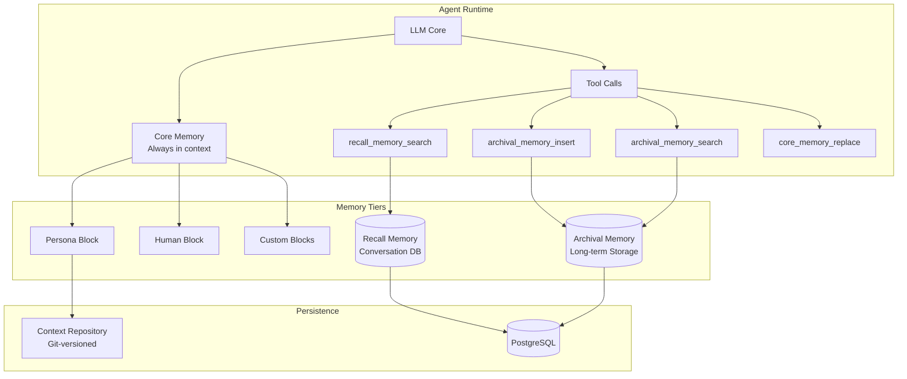

# Letta (MemGPT)

> **The platform for building stateful agents: AI with advanced memory that can learn and self-improve over time.**

| Field | Value |
|-------|-------|
| Category | 🧠 Agent Memory & Context |
| Repository | [letta-ai/letta](https://github.com/letta-ai/letta) |
| GitHub Stars | 21,500 (as of 2026-03-08) |
| Publisher | Letta AI (startup, UC Berkeley spinout) |
| License | Apache-2.0 |
| Tech Stack | Python (99.4%), PostgreSQL/SQLite, Alembic, OpenTelemetry, Docker, REST API |
| Maturity | 🟢 Production |
| Last Analyzed | 2026-03-08 |

---

## Burak's Notes

> *[Your personal observations, gut reactions, open questions, or ideas for how this tool connects to ongoing work. This section is yours — agents won't overwrite it.]*

---

## Relevance Scores

| Dimension | Score | Notes |
|-----------|-------|-------|
| **Relevance to our vision** | 6/10 | The "LLM-as-Operating-System" paradigm and self-editing memory blocks are the most intellectually relevant memory architecture to our work. Context Repositories (git-based versioning of memory) directly echoes our file-based approach. But adopting the framework would mean replacing our prompt-engineering-only approach with a Python server. |
| **Novelty** | 7/10 | The self-editing memory concept — where the agent itself decides what to remember, forget, and restructure — is genuinely novel and goes beyond what we've implemented. The Agent File (.af) format for serializing agent state is also a new primitive. |
| **Actionable** | 4/10 | We can't adopt the framework directly (Python server, PostgreSQL, Docker). But the *patterns* — self-editing memory blocks, tiered memory hierarchy, context window management as virtual memory paging — are directly applicable to our prompt engineering approach. |

---

## Overview

Letta (formerly MemGPT) pioneered the "LLM-as-Operating-System" paradigm: the language model manages its own memory like an OS manages RAM and disk. Instead of the application deciding what context to load, the LLM itself decides what to write to memory, what to retrieve from archival storage, and how to restructure its own context window. This is fundamentally different from RAG systems where retrieval is application-controlled.

The architecture uses a tiered memory system: **core memory** (always in context, like RAM — persona info, user info, scratchpad), **recall memory** (conversation history, searchable like a database), and **archival memory** (long-term storage for unlimited data, like disk). The agent can read from and write to all tiers using tool calls, effectively managing its own "virtual memory."

In 2026, Letta introduced Context Repositories — a rebuild of memory based on programmatic context management and git-based versioning. This is a significant evolution: agent memory gets version history, branching, and diffing, treating memory as code. They also released the Agent File (.af) format for serializing complete agent state (memory, tools, behavior) into a portable, versionable file.

---

## Technical Architecture

**Core abstractions:**
- **Memory Blocks:** Labeled, editable text sections always present in context (persona, human, scratchpad). The LLM edits these directly via `core_memory_replace` and `core_memory_append` tool calls.
- **Recall Memory:** Full conversation history stored in PostgreSQL, searchable by the agent. Functions like episodic memory.
- **Archival Memory:** Unlimited long-term storage. Agent can insert and search arbitrarily. Functions like semantic/declarative memory.
- **Context Repositories:** Git-backed memory versioning with branching, commits, and diffs.
- **Agent File (.af):** Portable serialization format for complete agent state.

**Infrastructure:**
- PostgreSQL (production) or SQLite (development) for persistence
- Alembic for database migrations
- OpenTelemetry for observability
- REST API backend with Python/TypeScript SDKs
- Docker deployment support
- Nginx reverse proxy in production

---

## Publisher Background

Letta was founded by Charles Packer and Sarah Wooders, UC Berkeley PhD students from the Sky Computing Lab (led by Ion Stoica, Databricks co-founder, and Joseph Gonzalez). The MemGPT paper was a breakthrough publication that defined the "LLM-as-OS" paradigm.

Raised $10M Seed at $70M valuation led by Felicis, with angel investors including Jeff Dean (Google DeepMind Chief Scientist), Clem Delangue (HuggingFace CEO), Cristobal Valenzuela (Runway CEO), Jordan Tigani (MotherDuck CEO), Tristan Handy (dbt Labs CEO), Robert Nishihara (Anyscale co-founder), and Barry McCardel (Hex CEO). This is an exceptional angel list that signals deep credibility in both AI and infrastructure.

100+ contributors, 175 releases, active development. The team has serious academic pedigree combined with production engineering chops.

---

## What's Valuable for Us

1. **Self-editing memory pattern:** This is the key insight. Instead of *our application* deciding what agents remember, *the agent itself* writes to memory. We already do a version of this with our Always-On Memory Agent's consolidation step, but Letta makes it continuous and granular. We should study their `core_memory_replace` / `core_memory_append` tool design and consider giving our agents explicit "write to memory" tools.

2. **Tiered memory hierarchy as design pattern:** Core (always in context) → Recall (searchable history) → Archival (long-term). This maps directly to our architecture: CLAUDE.md + MEMORY.md (core) → conversation history (recall) → research catalogue files (archival). Validating our approach with more formal structure.

3. **Context Repositories (git-based memory):** This is the most directly relevant feature. Memory as git-versioned files with branching and diffing. We're already doing this implicitly (our memory files are in git), but making it explicit with commits and diffs per memory operation is a pattern worth adopting.

4. **Agent File (.af) format:** Serializing complete agent state into a portable file. Relevant for our orchestrator's agent spawning — if we could snapshot and restore agent state, recovery from crashes becomes trivial.

---

## What's NOT Relevant

| Feature | Why Not |
|---------|---------|
| **PostgreSQL requirement** | Infrastructure overhead. Our agents use files, not databases. |
| **Python server runtime** | We're TypeScript/shell/Claude-first. Running a Python server adds operational complexity. |
| **Docker deployment** | We run on one Mac with tmux. Docker is unnecessary infrastructure. |
| **REST API / SDK approach** | We integrate via prompt engineering and tool use, not programmatic APIs. |
| **Multi-model support (GPT-5.2, etc.)** | We're Claude-first. Model-agnostic abstraction adds complexity we don't need. |
| **Letta Code CLI** | Competes with Claude Code. We're committed to Claude Code as our agent runtime. |

---

## Future Use Cases

- **Phase 1-3:** Study the self-editing memory pattern and consider adding explicit "write to memory" tools to our agents. The tiered memory hierarchy validates our existing approach.
- **Phase 3 (Days 60-90):** Context Repositories concept could inform how we version agent memory in our thin shared layer. Git-based memory diffing is directly compatible with our approach.
- **Phase 4 (Days 90+):** Agent File (.af) format could be useful for agent state portability if we scale to many concurrent agents that need checkpointing and recovery.

---

## Key Takeaway

> **Letta's "LLM-as-OS" paradigm — where agents manage their own memory through self-editing tools rather than application-controlled RAG — is the most intellectually aligned memory architecture to our approach, and their git-based Context Repositories validate our file-based memory versioning, even though adopting the framework itself conflicts with our Claude-first, zero-infra stack.**
