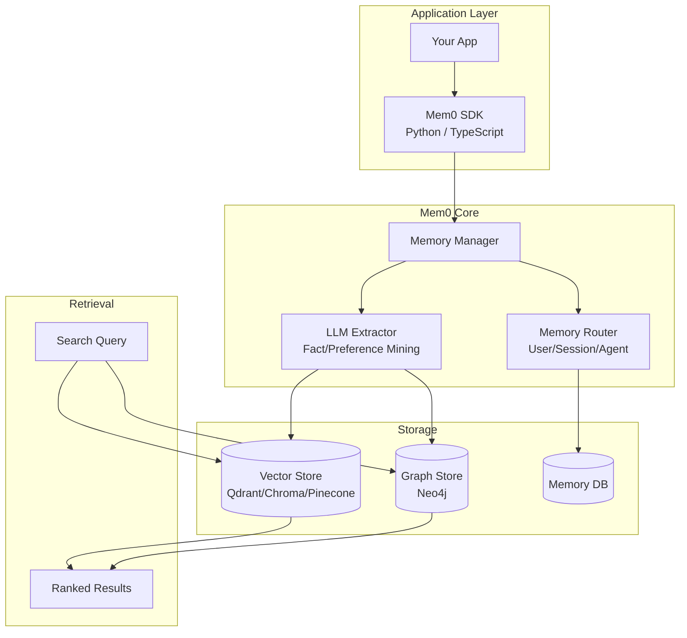

# Mem0

> **Universal memory layer for AI agents — intelligently compresses chat history into optimized memory representations, enabling personalized AI interactions across sessions.**

| Field | Value |
|-------|-------|
| Category | 🧠 Agent Memory & Context |
| Repository | [mem0ai/mem0](https://github.com/mem0ai/mem0) |
| GitHub Stars | 49,000 (as of 2026-03-08) |
| Publisher | Mem0 AI (startup, YC S24) |
| License | Apache-2.0 |
| Tech Stack | Python (66.5%), TypeScript (20.7%), vector stores (Qdrant/Chroma/Pinecone/etc.), graph stores (Neo4j), LLM-powered extraction |
| Maturity | 🟢 Production |
| Last Analyzed | 2026-03-08 |

---

## Burak's Notes

> *[Your personal observations, gut reactions, open questions, or ideas for how this tool connects to ongoing work. This section is yours — agents won't overwrite it.]*

---

## Relevance Scores

| Dimension | Score | Notes |
|-----------|-------|-------|
| **Relevance to our vision** | 4/10 | Mem0 is a hosted memory API designed for SaaS products that need user personalization at scale. Our use case is agent-to-agent memory in a solo orchestrator setup, not user-facing personalization. The architecture (vector DB + graph DB) directly conflicts with our validated no-vector-DB approach. |
| **Novelty** | 4/10 | Multi-level memory (user/session/agent) and automatic memory extraction from conversations are well-trodden ground in our research. The "intelligent compression" is essentially what our Always-On Memory Agent does with consolidation. No major new patterns. |
| **Actionable** | 2/10 | Requires vector store + graph store infrastructure. Python-first with hosted API emphasis. Nothing we can directly adopt into our TypeScript/shell/file-based stack. |

---

## Overview

Mem0 is the most popular open-source memory layer for AI applications by GitHub stars (49K), positioning itself as the "memory API" that sits between your application and LLM. The core value proposition: add a single line of code to give your AI persistent memory across sessions. It automatically extracts important facts, preferences, and context from conversations, stores them in a hybrid vector + graph database, and retrieves relevant memories when the user returns.

The system supports multi-level memory: **User memory** (persistent preferences and facts about a specific user), **Session memory** (context within a single conversation), and **Agent memory** (the AI's own learned behaviors and knowledge). Memory operations are simple: `m.add(messages, user_id)` to store, `m.search(query, user_id)` to retrieve, with the LLM handling the intelligence of what to extract and how to match.

Mem0 is heavily oriented toward SaaS builders who need personalized AI at scale — customer support bots that remember user history, AI tutors that adapt to learning styles, healthcare assistants that track patient context. They claim +26% accuracy vs OpenAI Memory, 91% faster responses, and 90% lower token usage through intelligent compression. The company raised $24M ($3.9M seed + $20M Series A) with backing from YC, Basis Set Ventures, Peak XV Partners, and the GitHub Fund.

---

## Technical Architecture

**Core abstractions:**
- **Memory.add():** Accepts conversation messages + user/session/agent ID. LLM extracts facts and preferences automatically.
- **Memory.search():** Semantic search across stored memories for a given user/session/agent.
- **Memory.get_all():** Retrieve all memories for a given scope.
- **OpenMemory MCP:** Exposes memories as an MCP server for agent framework integration.

**Storage backends supported:**
- Vector stores: Qdrant, Chroma, Pinecone, Weaviate, Milvus, Azure AI Search, Redis, Elasticsearch
- Graph stores: Neo4j, FalkorDB
- LLMs: OpenAI (default gpt-4.1-nano), Claude, and others

**Memory types:**
- Episodic (event-based recall)
- Semantic (factual knowledge)
- Procedural (how-to patterns)
- Associative (relationship-based connections)

---

## Publisher Background

Mem0 was founded by Taranjeet Singh (CEO) and Deshraj Yadav (CTO). Taranjeet was previously first growth engineer at Khatabook (YC S18), then Senior PM. Part of Y Combinator S24 batch. Raised $24M total — $3.9M seed led by Kindred Ventures, $20M Series A led by Basis Set Ventures with YC, Peak XV Partners, and GitHub Fund participating. The company has 17 repositories on GitHub and publishes academic work (arXiv paper on production-ready agent memory). Well-funded, well-connected, and aggressively growing.

---

## What's Valuable for Us

1. **Memory type taxonomy (episodic/semantic/procedural/associative):** Even though we won't use their implementation, this classification framework is useful for thinking about what our agents should remember. Our Always-On Memory Agent currently does "semantic" (facts about projects) and "procedural" (how we do things). We could be more deliberate about episodic (what happened in each session) and associative (how concepts connect).

2. **OpenMemory MCP server:** Their approach to exposing memories through MCP is worth studying as a reference implementation if we ever build a memory MCP server for our agents.

3. **Automatic fact extraction from conversations:** The pattern of having an LLM mine conversations for memorable facts is something we could add to our consolidation-as-sleep step. Currently our Always-On Memory Agent summarizes; it could also extract discrete facts.

---

## What's NOT Relevant

| Feature | Why Not |
|---------|---------|
| **Vector store dependency** | Directly conflicts with our validated no-vector-DB approach. We proved file-based consolidation works. |
| **Graph store (Neo4j)** | Infrastructure overhead we don't need. Same as Cognee assessment. |
| **SaaS/API orientation** | Designed for multi-tenant SaaS products with thousands of users. We have 1 user (Burak) and a few agents. |
| **User personalization focus** | Our memory problem is agent-to-agent context transfer, not user preference learning. |
| **Python-first SDK** | Our stack is TypeScript/shell. Adding Python infra adds operational complexity. |
| **Hosted platform** | We don't want vendor lock-in for memory. Our files-in-git approach gives us full ownership. |
| **Browser extension** | Consumer product feature, not relevant to our terminal-first workflow. |

---

## Future Use Cases

- **Phase 1-3:** Not relevant. Our file-based memory consolidation is simpler and sufficient for our scale.
- **Phase 4 (Days 90+):** If we build client-facing AI products (SaaS factory line), Mem0's multi-user memory management could be useful as infrastructure. But we'd evaluate it fresh against alternatives at that point.
- **Long-term:** The OpenMemory MCP concept might become relevant if MCP becomes the standard agent memory interface.

---

## Key Takeaway

> **Mem0 is the most popular agent memory library (49K stars) but is architected for SaaS product builders who need multi-user personalization at scale — our single-operator, agent-to-agent, file-based memory approach is fundamentally different and simpler, making Mem0 a poor fit despite its market traction.**
