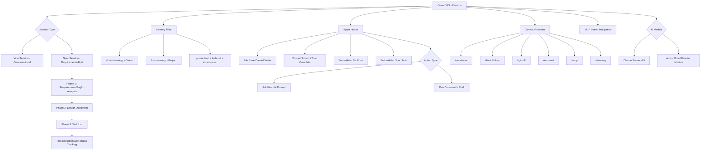

# Kiro

> **An agentic IDE from AWS that works alongside you from prototype to production using spec-driven development.**

| Field | Value |
|-------|-------|
| Category | 🖥️ Developer GUI / IDE |
| Repository | [kirodotdev/Kiro](https://github.com/kirodotdev/Kiro) (issues-only repo) |
| GitHub Stars | 3,142 (as of 2026-03-08) |
| Publisher | Amazon Web Services (bigtech — operated as distinct brand under AWS umbrella) |
| License | Proprietary / Commercial |
| Tech Stack | Code OSS (VS Code fork), Electron, Claude Sonnet 4.5 + multi-model "Auto" mode, TypeScript |
| Maturity | 🟢 Production |
| Last Analyzed | 2026-03-08 |

---

## Burak's Notes

> *[Your personal observations, gut reactions, open questions, or ideas for how this tool connects to ongoing work. This section is yours — agents won't overwrite it.]*

---

## Relevance Scores

| Dimension | Score | Notes |
|-----------|-------|-------|
| **Relevance to our vision** | 4/10 | GUI-first IDE, same category as Cursor. We are terminal-first with Claude Code CLI. However, the spec-driven development pattern (requirements -> design -> tasks) is a structured approach worth studying as a process pattern. Steering files are essentially their version of AGENTS.md + CLAUDE.md. |
| **Novelty** | 5/10 | The specs workflow (EARS notation, three-phase requirements -> design -> tasks) is a more opinionated take than Cursor's free-form agent. Agent hooks with file/event triggers are interesting but similar to Cursor Automations. The steering system validates our CLAUDE.md approach. Nothing paradigm-shifting. |
| **Actionable** | 3/10 | The spec-driven pattern could inspire a structured task decomposition template for our orchestrator, but we'd implement it as prompt engineering in our agent spawning, not through Kiro's IDE. Steering file patterns already exist in our `.claude/` setup. |

---

## Overview

Kiro is Amazon's entry into the AI IDE market, launched June 2025 as a direct competitor to Cursor and Windsurf. Built on Code OSS (the open-source VS Code foundation), it differentiates itself through "spec-driven development" — a structured workflow that converts natural language prompts into formal requirements documents, architectural designs, and sequenced implementation tasks before any code is written. This is Amazon's answer to the "vibe coding produces unmaintainable code" problem.

The IDE operates in two modes: **Vibe Sessions** for exploratory, conversational coding (equivalent to Cursor's Agent mode), and **Spec Sessions** for structured, requirements-first development. Specs generate three markdown files in `.kiro/specs/`: `requirements.md` (user stories with EARS-notation acceptance criteria), `design.md` (architecture, sequence diagrams, error handling), and `tasks.md` (dependency-sequenced implementation steps with real-time status tracking).

The third differentiator is **Agent Hooks** — automated triggers that fire on file saves, agent turns, tool invocations, or spec task execution. Hooks can either "Ask Kiro" (run an AI prompt) or "Run Command" (execute shell commands), enabling background automation for documentation, testing, and code quality without manual intervention. Combined with **Steering Files** (persistent markdown instructions in `.kiro/steering/`) and native MCP support, Kiro presents a more structured, enterprise-friendly approach than Cursor's flexibility-first philosophy.

---

## Technical Architecture

**Key components:**

| Component | Purpose | Detail |
|-----------|---------|--------|
| **Specs System** | Structured dev workflow | `.kiro/specs/` with requirements.md, design.md, tasks.md per feature/bugfix |
| **Steering Files** | Persistent AI instructions | Markdown files with YAML front matter; 4 inclusion modes (always, fileMatch, manual, auto) |
| **Agent Hooks** | Event-driven automation | 5 trigger types, 2 action types (AI prompt or shell command) |
| **Context Providers** | Scoped context assembly | `#`-prefixed mentions for codebase, files, git, terminal, MCP, steering |
| **MCP Integration** | External tool connectivity | Native Model Context Protocol with dedicated server management tab |
| **AGENTS.md Support** | Convention compatibility | Recognizes AGENTS.md files in steering paths, always included |

**Credit system:** 1 credit = 1 unit of work per prompt. Sonnet 4 costs ~1.3x vs Auto mode. Metered to 2 decimal places.

**Pricing:** Free ($0, 50 credits), Pro ($20/mo, 1K credits), Pro+ ($40/mo, 2K credits), Power ($200/mo, 10K credits). Overage at $0.04/credit. Enterprise with SAML/SCIM SSO available.

---

## Publisher Background

Kiro is built by Amazon Web Services, the dominant cloud infrastructure provider. While operated under its own brand (kiro.dev, @kirodotdev), it is an AWS product with enterprise security posture, IAM Identity Center integration, and SAML/SCIM SSO. The GitHub repo (kirodotdev/Kiro) was created June 17, 2025, and serves as an issues-only repository — the product itself is proprietary/closed-source.

AWS's entry into the AI IDE space represents a strategic play to complement Amazon Q Developer (their existing AI coding assistant integrated into AWS services) with a standalone IDE product. This is Amazon's response to Cursor's dominance and Microsoft's GitHub Copilot/VS Code integration. The backing of the world's largest cloud provider gives Kiro enterprise credibility and likely long-term investment commitment, though it also means the product will inevitably be optimized for AWS ecosystem integration.

With 3,142 GitHub stars and 2,344 open issues in under a year, adoption is growing but still modest compared to Cursor's market position.

---

## What's Valuable for Us

| Pattern to Study | Where in Kiro | How to Apply |
|-----------------|---------------|--------------|
| **Spec-driven decomposition** | `.kiro/specs/` three-phase workflow | Our orchestrator already decomposes tasks for agents, but Kiro's explicit requirements -> design -> tasks pipeline could formalize how we brief coding agents. Create a lightweight spec template for complex features before spawning agents. |
| **Steering file architecture** | `.kiro/steering/` with 4 inclusion modes | Validates our `.claude/` approach. The `fileMatch` conditional inclusion (only load steering when working on matching files) is clever for large codebases — could reduce context window pollution per Governing Principle 3. |
| **Agent hooks pattern** | Event-driven automation triggers | Our orchestrator hooks (session-start, pre-compact, handoff) are a simpler version of the same concept. Kiro's "before/after tool use" triggers could inspire pre/post guards on agent operations. |
| **AGENTS.md compatibility** | Steering system recognizes AGENTS.md | Confirms AGENTS.md as an emerging cross-tool standard. Our existing catalogue entry on AGENTS.md (9/10 relevance) is further validated. |

---

## What's NOT Relevant

| Concern | Why |
|---------|-----|
| **GUI-first IDE paradigm** | Same problem as Cursor — we're terminal-first with tmux + Claude Code CLI. Kiro's value is in the visual spec management UI. Our orchestrator doesn't need a graphical editor. (Governing Principle: context separation, terminal-first) |
| **Single-developer productivity** | Like Cursor, optimizes for one developer + AI. We orchestrate 2-3 parallel agents. Different problem space entirely. |
| **Credit-based pricing** | At $200/mo for 10K credits, complex tasks could burn through credits fast. We already have Claude Max at $200/mo for unlimited CLI usage — adding Kiro would be redundant cost for less capability in our workflow. |
| **AWS ecosystem gravity** | Kiro will inevitably pull users toward AWS services (Lambda, DynamoDB, etc.). Our architecture is cloud-agnostic and Notion-centric. AWS lock-in is unwanted. |
| **Closed-source core** | No ability to study internals, extract patterns at code level, or adapt the runtime. Unlike open-source tools in our catalogue (Overstory, Pi Agent), we can't learn from the implementation. |

---

## Future Use Cases

- **Phase 1-2 (Days 1-60):** Not relevant. Terminal-first, Claude Code CLI is our primary interface.
- **Phase 3 (Days 60-90):** Study the specs workflow if we need to formalize how the orchestrator briefs coding agents on complex features. The three-phase decomposition (requirements -> design -> tasks) could become a prompt template.
- **Phase 4 (Days 90+):** If onboarding junior developers or contractors to work alongside the agent system, Kiro's structured approach might be useful as a client-facing development tool — it enforces the "think before coding" discipline that vibe coding lacks. Also watch for AWS integration depth: if Kiro gets deep Lambda/Step Functions hooks, it could become relevant for serverless agent deployment.

---

## Key Takeaway

> **Kiro is AWS's structured alternative to Cursor's free-form AI coding — its spec-driven workflow (requirements -> design -> tasks) is a useful process pattern to study, but the GUI-first, single-developer, credit-metered approach is orthogonal to our terminal-first multi-agent orchestrator.**
