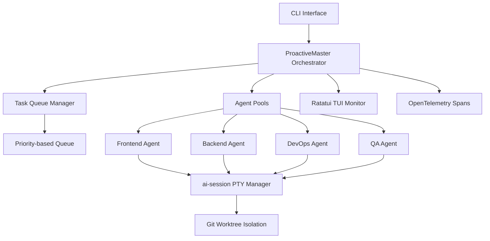

# ccswarm

> **Multi-agent orchestration system using Claude Code with Git worktree isolation and specialized AI agents for collaborative development.**

| Field | Value |
|-------|-------|
| Category | 🎛️ Orchestration Platforms |
| Repository | [nwiizo/ccswarm](https://github.com/nwiizo/ccswarm) |
| GitHub Stars | 118 (as of 2026-03-08) |
| Publisher | nwiizo (solo) |
| License | MIT |
| Tech Stack | Rust (Edition 2024), Tokio, Ratatui TUI, OpenTelemetry, ai-session crate (PTY) |
| Maturity | 🟡 Early |
| Last Analyzed | 2026-03-08 |

---

## Burak's Notes

> *[Your personal observations, gut reactions, open questions, or ideas for how this tool connects to ongoing work. This section is yours — agents won't overwrite it.]*

---

## Relevance Scores

| Dimension | Score | Notes |
|-----------|-------|-------|
| **Relevance to our vision** | 6/10 | Solves the same problem we solve (multi-agent coordination with Claude Code + worktrees), but in Rust instead of prompt engineering. The worktree isolation pattern validates our approach. |
| **Novelty** | 4/10 | Git worktree isolation and PTY session management are patterns we already implement. Type-state compile-time validation is new but Rust-specific. |
| **Actionable** | 3/10 | Written in Rust — not directly adoptable into our TypeScript/shell stack. Conceptually validates our existing patterns more than it teaches new ones. |

---

## Overview

ccswarm is a Rust-native workflow automation framework that orchestrates specialized AI agents using Claude Code CLI. It provides task delegation infrastructure, template-based scaffolding, and Git worktree isolation for parallel development across multiple agent roles. The system implements native PTY sessions via the `ai-session` crate, meaning it can spawn and manage agent processes without relying on tmux or screen.

The architecture follows an Actor Model with specialized agent pools (Frontend, Backend, DevOps, QA) coordinated by a "ProactiveMaster" orchestrator that analyzes progress, generates tasks, resolves dependencies, and detects bottlenecks. A real-time TUI built on Ratatui provides live monitoring of all agent sessions, task queues, and resource utilization.

Notably, ccswarm is still early — the orchestrator coordination loop structure exists but isn't fully integrated, the parallel executor framework is ready but not wired to orchestration, and multi-provider AI integration (5 providers designed) isn't active yet. The project has 97 commits and 118 stars, suggesting active solo development with limited community adoption.

---

## Technical Architecture

**Key architectural patterns:**

| Pattern | Implementation | Notes |
|---------|---------------|-------|
| **Type-State Pattern** | Compile-time validation of agent state transitions | Rust-specific — prevents invalid state at compile time |
| **Channel-Based Orchestration** | Tokio channels for message passing | No shared mutable state between agents |
| **Actor Model** | Specialized agent pools with dedicated task queues | Each agent type has its own spawn/lifecycle |
| **Git Worktree Isolation** | Separate worktrees per agent | Parallel development without merge conflicts |
| **Template System** | Variable substitution in task prompts | Similar to our CLAUDE.md-based prompt engineering |

**Project structure:** Cargo workspace with main crate in `crates/ccswarm/`. Modules: CLI commands, orchestrator (ProactiveMaster), agent types, session management, template system, TUI, and resource monitoring. Minimal test suite (8 essential tests).

---

## Publisher Background

nwiizo is a solo developer building ccswarm as an open-source project. The repository was created June 2025, has 97 commits, 14 forks, and 118 stars. No visible company backing or funding. The choice of Rust (Edition 2024) and the sophisticated architecture (type-state patterns, OpenTelemetry integration, actor model) suggest an experienced systems programmer. No other notable public projects immediately visible.

---

## What's Valuable for Us

| Pattern to Study | Where in ccswarm | How to Apply |
|-----------------|------------------|--------------|
| **Validates worktree isolation** | Core architecture decision | Confirms our git worktree approach for parallel agent work is the right call — they independently arrived at the same pattern |
| **ProactiveMaster concept** | Orchestrator module | Their idea of an orchestrator that proactively analyzes progress and generates tasks (vs. waiting for instructions) is worth considering for our Phase 3 autonomy layer |
| **OpenTelemetry spans** | Tracing/observability module | When we need observability (Phase 3+), their span tracking approach for agent sessions is a clean reference |
| **PTY session management** | `ai-session` crate | If we ever need to move beyond tmux, native PTY management via a library is the alternative path |

---

## What's NOT Relevant

| Concern | Why |
|---------|-----|
| **Rust implementation** | We're TypeScript/shell. Rewriting our orchestrator in Rust would violate Principle #7 (build only what you need). The prompt engineering approach is lighter and more flexible. |
| **TUI monitoring** | We have no need for a terminal UI — our state files + devlogs serve the same monitoring purpose with less complexity. |
| **Unfinished features** | Parallel executor, multi-provider integration, ACP WebSocket, Sangha voting — all planned but not implemented. Can't learn from vaporware. |
| **Agent type rigidity** | Fixed agent pools (Frontend, Backend, DevOps, QA) are less flexible than our prompt-driven role assignment. |

---

## Future Use Cases

- **Phase 1 (Days 1–3):** Nothing directly adoptable.
- **Phase 2 (Days 4–60):** Monitor project maturity. If the ProactiveMaster and parallel executor land, revisit for pattern ideas.
- **Phase 3 (Days 60–90):** If adding observability, study their OpenTelemetry span tracking as a reference implementation.
- **Phase 4 (Days 90+):** If ever considering a compiled orchestrator binary (performance at scale), ccswarm's Rust architecture is the reference.

---

## Key Takeaway

> **ccswarm validates our worktree isolation pattern independently but is too early and too Rust-specific to adopt — file it as a "watch" project and revisit when the orchestrator coordination loop actually ships.**
