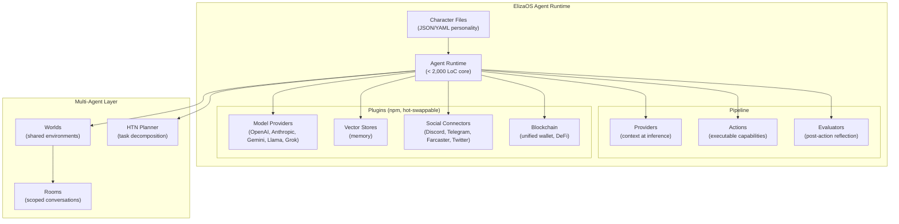

# ElizaOS

> **Autonomous agents for everyone — a TypeScript agent operating system with plugin-based architecture, personality-driven Character Files, and Worlds/Rooms spatial abstraction for multi-agent coordination.**

| Field | Value |
|-------|-------|
| Category | 🎛️ Orchestration Frameworks |
| Repository | [elizaOS/eliza](https://github.com/elizaOS/eliza) |
| GitHub Stars | ~17,300 (as of 2026-03-08) |
| Publisher | elizaOS / Shaw Walters (community + startup) |
| License | MIT |
| Tech Stack | TypeScript, Node.js, PostgreSQL/SQLite, npm plugin system |
| Maturity | 🟢 Production |
| Last Analyzed | 2026-03-05 |

---

## Burak's Notes

> *[Your personal observations, gut reactions, open questions, or ideas for how this tool connects to ongoing work. This section is yours — agents won't overwrite it.]*

---

## Relevance Scores

| Dimension | Score | Notes |
|-----------|-------|-------|
| **Relevance to our vision** | 3/10 | Web3/chatbot DNA — fundamentally different problem domain from coding agent orchestration. Worlds/Rooms concept is interesting but oriented toward chat, not terminals. |
| **Novelty** | 4/10 | Character Files and plugin hot-swap are well-known patterns. Worlds/Rooms spatial model is conceptually novel for agent context isolation. |
| **Actionable** | 2/10 | No coding agent primitives (no file edit, terminal access, code review). Would require building everything from scratch as plugins. |

---

## Overview

ElizaOS is a full agent operating system, not just a framework. It is designed from the ground up for building personality-driven agents that interact with users across social platforms (Discord, Telegram, Farcaster, Twitter). Its architecture revolves around an Agent Runtime that manages database connections, plugin lifecycle, memory retrieval, and action dispatch — each agent is an Agent Runtime instance configured by a Character File (JSON/YAML personality definition).

The v2 architecture introduced an event-driven model (replacing v1's polling), Hierarchical Task Networks (HTN) for dynamic task decomposition, and a unified wallet system for cross-chain asset management. The core runtime is lightweight (under 2,000 lines), with all capabilities arriving as hot-swappable npm plugins: model providers, vector stores, social connectors, blockchain integrations, and custom actions/evaluators/providers.

Multi-agent coordination uses two spatial abstractions: **Worlds** (shared environments analogous to servers/workspaces) and **Rooms** (scoped conversations analogous to channels/DM threads). Agents within a World can delegate tasks, deliberate in group Rooms, and load-balance based on specialization. Ranked #14 on the ROSS (Runa Open Source Startup) Index.

---

## Technical Architecture

**Core abstractions:**

| Component | Purpose | Maps to L-Thread |
|-----------|---------|------------------|
| **Agent Runtime** | Central coordinator: DB, plugins, memory, dispatch | Orchestrator process |
| **Character Files** | Agent persona, knowledge, constraints | Agent prompts / CLAUDE.md |
| **Providers** | Supply context at inference time ("what does the agent know?") | Context assembly |
| **Actions** | Executable capabilities ("what can the agent do?") | Tool definitions |
| **Evaluators** | Post-action reflection ("did it work? what next?") | No equivalent (gap) |
| **Worlds** | Shared multi-agent environments | tmux sessions |
| **Rooms** | Scoped conversations within a World | tmux panes |

**Infrastructure requirements:** Node.js, PostgreSQL or SQLite, optional vector store. Not a single-binary solution.

---

## Publisher Background

ElizaOS was created by Shaw Walters and has grown into a large open-source community project. The framework originated in the Web3/crypto space and is closely associated with the ai16z ecosystem. It has hundreds of contributors and is ranked #14 on the ROSS Index. The project has strong momentum in the autonomous trading agent and social bot communities, with a dedicated documentation site (docs.elizaos.ai) and active plugin ecosystem.

---

## What's Valuable for Us

| Pattern to Study | Where in ElizaOS | How to Apply |
|-----------------|------------------|--------------|
| **Worlds/Rooms spatial model** | Multi-agent coordination layer | Conceptual reference for agent context isolation. Our tmux sessions/panes map loosely to Worlds/Rooms, but with terminal I/O instead of chat messages. Worth studying for naming and abstraction clarity. |
| **Evaluators (post-action reflection)** | Pipeline stage after Actions | We have no equivalent of post-action reflection hooks. Adding an evaluator step after agent task completion could improve quality: "did the task succeed? should we retry? what context should carry forward?" |
| **Character Files (declarative agent config)** | Agent definition surface | Our agent prompts are embedded in markdown. A structured, schema-validated agent config (separate from the prompt) could improve agent spawning consistency. |
| **Plugin hot-swap at runtime** | Plugin lifecycle management | If we ever need to reconfigure agent capabilities mid-session without restarting, their plugin loading pattern is a reference. |

---

## What's NOT Relevant

> [!CAUTION]
> **Do NOT adopt ElizaOS as a base.** It solves a fundamentally different problem.

| Concern | Detail |
|---------|--------|
| **Web3/blockchain DNA** | The framework assumes crypto wallets, DeFi interactions, and token management. Using it for coding agents means ignoring or stripping the core value proposition. |
| **No coding agent primitives** | No read/write/edit/bash tools. No concept of file editing, terminal access, or code review. Everything would need to be built as custom plugins. |
| **Chat-oriented, not terminal-oriented** | Worlds/Rooms are designed for message-based chat interactions, not terminal I/O or file system operations. |
| **Heavyweight runtime** | Full Agent Runtime with memory, evaluators, providers, and DB is heavyweight compared to our minimalist tmux + state JSON approach. Violates our principle of building only what we need. |
| **Platform connectors irrelevant** | Discord, Telegram, Farcaster, Twitter connectors add no value for coding agent orchestration. |

---

## Future Use Cases

- **Phase 1 (Days 1-3):** None. No actionable patterns for immediate adoption.
- **Phase 2 (Days 4-60):** Study the Evaluator pattern if implementing post-task quality checks.
- **Phase 3 (Days 60-90):** If adding structured agent configuration (beyond markdown prompts), reference Character Files schema for inspiration.
- **Phase 4 (Days 90+):** If building a social/communication layer for agents (e.g., Notion-based agent coordination), the Worlds/Rooms abstraction may become a useful reference for spatial context isolation.

---

## Key Takeaway

> **ElizaOS is the most mature agent operating system for chat-based, Web3-native autonomous agents — but its DNA is social bots and DeFi, not coding agents, making it architecturally misaligned for our use case; the only portable pattern worth studying is the Evaluator (post-action reflection) concept.**
