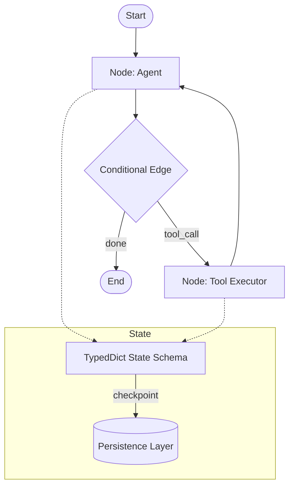

# LangGraph

> **Build resilient language agents as graphs — a low-level orchestration framework for stateful, long-running agents with durable execution.**

| Field | Value |
|-------|-------|
| Category | 🎛️ Orchestration Platforms |
| Repository | [langchain-ai/langgraph](https://github.com/langchain-ai/langgraph) |
| GitHub Stars | 25,800 (as of 2026-03-08) |
| Publisher | LangChain Inc (startup, founded by Harrison Chase, Series A funded) |
| License | MIT |
| Tech Stack | Python (99.3%), TypeScript (langgraphjs), inspired by Google Pregel/Apache Beam, LangSmith integration |
| Maturity | 🟢 Production (v0.4.14 CLI, trusted by Klarna/Replit/Elastic) |
| Last Analyzed | 2026-03-08 |

---

## Burak's Notes

> *[Your personal observations, gut reactions, open questions, or ideas for how this tool connects to ongoing work. This section is yours — agents won't overwrite it.]*

---

## Relevance Scores

| Dimension | Score | Notes |
|-----------|-------|-------|
| **Relevance to our vision** | 5/10 | Graph-based state machines with checkpointing map well to our deterministic routing philosophy. But Python-first, LangChain ecosystem lock-in, and heavy abstraction layer make adoption impractical. |
| **Novelty** | 5/10 | Durable execution + graph-based agent routing is a pattern we've studied. The checkpointing/persistence model and human-in-the-loop state inspection are well-implemented versions of known concepts. |
| **Actionable** | 3/10 | Python-first. The TypeScript version (langgraphjs) exists but is a second-class citizen. Concepts are useful references but code is not portable. |

---

## Overview

LangGraph is LangChain's answer to the "agents need structure" problem. Where LangChain gave you chains (linear) and agents (autonomous), LangGraph gives you graphs — directed state machines where nodes are functions and edges define transitions. It was explicitly inspired by Google's Pregel (graph processing) and Apache Beam (dataflow), applying distributed systems concepts to agent orchestration.

The key insight is treating agent workflows as compiled state machines with checkpointing. Every step persists state, enabling durable execution (survive crashes), human-in-the-loop (pause, inspect, modify state, resume), and time-travel debugging (replay from any checkpoint). This is philosophically aligned with our deterministic routing approach — the graph topology IS the routing logic, not an LLM deciding what to do next.

LangGraph is Python-first but has a TypeScript port (langgraphjs). It integrates deeply with the LangChain ecosystem (LangSmith for observability, LangServe for deployment) but can be used independently. At 25.8K stars with 287 contributors, it's the second most popular agent orchestration framework after CrewAI, and arguably the more production-serious one.

---

## Technical Architecture

**Core abstractions:**

| Concept | Description |
|---------|-------------|
| **StateGraph** | Graph definition with typed state schema (Python TypedDict or Pydantic) |
| **Nodes** | Functions that receive state, perform work, return state updates |
| **Edges** | Transitions between nodes — static, conditional, or dynamic |
| **Checkpointer** | Persistence layer that saves state after each node execution |
| **Compile** | Converts graph definition into executable runnable |
| **Subgraphs** | Nested graphs for modular composition |
| **Command** | Primitive for combined state updates + edge routing in one return |

**State management:** State is a TypedDict flowing through nodes. Each node receives full state, returns partial updates (reducer pattern). Checkpointer serializes state after each step. Supports memory (within-thread) and cross-thread persistent storage.

**Persistence options:** SQLite, PostgreSQL, or custom backends via checkpointer interface.

**Execution model:** Synchronous by default, async supported. Streaming of intermediate results. Supports branching (fan-out), joining (fan-in), and cycles (loops).

---

## Publisher Background

LangChain Inc was founded by Harrison Chase in 2022, becoming the de facto standard for LLM application development. They raised $25M Series A (Sequoia) and later additional funding. The company operates LangSmith (observability SaaS), LangServe (deployment), and LangGraph (orchestration). They have 100+ employees and a massive open-source community. LangGraph was their response to criticism that LangChain was too high-level and opinionated — it offers lower-level control while staying in the ecosystem. The "usable independently of LangChain" claim is technically true but the ecosystem gravity is strong.

---

## What's Valuable for Us

| Pattern | Where in LangGraph | How to Apply |
|---------|--------------------|--------------|
| **Graph-as-routing-topology** | `StateGraph` + conditional edges | Our state machine transitions in `orchestrator-state.json` are effectively a graph. LangGraph's explicit graph compilation validates this approach — we could formalize our routing as a graph definition for visualization/debugging. |
| **Checkpoint-based durability** | `Checkpointer` interface | State persistence after each orchestrator step. We do this with JSON state files — same concept, simpler implementation. Validates our approach. |
| **Command primitive** | `Command(update=..., goto=...)` | Combining state update + routing decision in a single return value is clean. Our `terminal-write` + state update is a two-step version of this. |
| **Human-in-the-loop via state inspection** | `interrupt()` + state modification | Pausing agent execution, inspecting state, modifying it, and resuming. We do this manually via tmux — LangGraph's programmatic version is more robust. |
| **Reducer pattern for state** | `Annotated[list, add_messages]` | Instead of replacing state, nodes append to it via reducers. Useful pattern for our devlog/activity tracking. |

---

## What's NOT Relevant

| Concern | Detail |
|---------|--------|
| **LangChain ecosystem gravity** | Despite "use independently" claims, LangGraph works best with LangSmith, LangServe, and LangChain models. This creates vendor dependency. |
| **Python-first** | langgraphjs exists but lags behind. Our TypeScript/shell stack has no natural integration path. |
| **Abstraction weight** | StateGraph → compile → invoke adds layers. Our direct state file + tmux approach is simpler and more debuggable for 2-3 agents. |
| **Overkill for small teams** | Graph-based routing shines at 10+ nodes with complex branching. Our 2-3 agent topology doesn't need this complexity. |
| **No terminal-native execution** | Designed for API servers and notebooks, not terminal-first Claude Code workflows. |

---

## Future Use Cases

- **Phase 1-3:** Reference only. Study the graph compilation and checkpointing patterns for inspiration, don't adopt the framework.
- **Phase 3 (Days 60-90):** If we need to visualize our orchestrator's routing topology, LangGraph's graph-as-code approach is a good model for building a visualization tool.
- **Phase 4 (Days 90+):** If a client uses LangGraph/LangChain, understanding the StateGraph API is essential for integration work. The TypeScript port (langgraphjs) could become viable if it matures.

---

## Key Takeaway

> **LangGraph validates our graph-based state machine approach to orchestration but wraps it in Python/LangChain ecosystem lock-in — study the checkpoint and reducer patterns, don't adopt the framework.**
