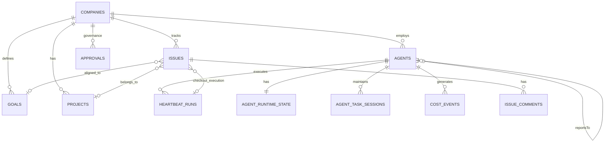

# Paperclip Architecture Analysis: Adapt or Reference?

**Date:** 2026-03-07
**Project:** [paperclipai/paperclip](https://github.com/paperclipai/paperclip)
**Tagline:** "Open-source orchestration for zero-human companies"

---

## What Paperclip Is

A **Node.js server + React UI** that orchestrates a team of AI agents to run a business. Not a coding agent itself — it sits *above* agents (Claude Code, Codex, Cursor, OpenClaw, OpenCode) and coordinates them like a project manager.

**Core stack:** TypeScript monorepo (pnpm), Drizzle ORM, embedded PostgreSQL (auto-managed), Express server, React dashboard.

---

## Architecture Deep-Dive

### Data Model (30+ Drizzle/Postgres tables)

The DB schema reveals Paperclip's actual architecture more clearly than any docs. Here are the core entities:



### Key Schema Details

| Table | Purpose | Notable Fields |
|-------|---------|----------------|
| **companies** | Multi-tenant isolation unit (≈ our "business line") | `budgetMonthlyCents`, `spentMonthlyCents`, `requireBoardApprovalForNewAgents`, `issuePrefix` |
| **agents** | Agent definitions with org hierarchy | `reportsTo` (self-referential), `adapterType`, `adapterConfig`, `budgetMonthlyCents`, `spentMonthlyCents`, `lastHeartbeatAt`, `permissions` |
| **goals** | Hierarchical goal tree (company→mission→task) | `level` (mission/objective/task), `parentId`, `ownerAgentId` |
| **issues** | Task board ("issues" ≈ our "tasks") | `assigneeAgentId`, `checkoutRunId`, `executionRunId`, `executionLockedAt`, `requestDepth`, `billingCode` |
| **heartbeat_runs** | Core execution record — every agent invocation | `invocationSource` (timer/assignment/on_demand/automation), `sessionIdBefore`/`After`, `usageJson`, `resultJson`, `contextSnapshot`, `logStore`, `logRef`, `exitCode` |
| **cost_events** | Per-token cost tracking | `provider`, `model`, `inputTokens`, `outputTokens`, `costCents`, per-issue/project/goal attribution |
| **agent_runtime_state** | Persistent agent state between runs | `sessionId`, `stateJson`, `totalInputTokens`, `totalOutputTokens`, `totalCostCents` |
| **agent_task_sessions** | Session persistence per task | `taskKey`, `sessionParamsJson` — allows agent to resume previous session for same task |
| **approvals** | Human governance gate | `type`, `requestedByAgentId`, `status` (pending/approved/denied), `payload` |
| **activity_log** | Audit trail | Everything that happens |

### The Adapter Pattern

Paperclip connects to agents via adapters — pluggable modules that know how to:

1. **Spawn** an agent process (e.g., `claude --prompt "..."`)
2. **Stream** stdout/stderr back to Paperclip
3. **Parse** session IDs and cost data from output
4. **Resume** sessions (pass previous session ID on next invocation)

Current adapters:

| Adapter | Harness | Style |
|---------|---------|-------|
| `claude-local` | Claude Code CLI | Local process |
| `codex-local` | OpenAI Codex CLI | Local process |
| `cursor-local` | Cursor | Local process |
| `openclaw` | OpenClaw (Pi-based) | Remote/API |
| `opencode-local` | OpenCode | Local process |

The adapter interface (`AdapterExecutionResult`) returns:
- `exitCode`, `signal`
- `sessionId`, `sessionParams`, `sessionDisplayId`, `clearSession`
- `usageJson` (token counts, costs)
- stdout/stderr streams

### The Heartbeat Engine (Core Orchestration)

The `heartbeat.ts` service (~600+ lines) is the brain. Key mechanics:

1. **Wakeup Requests** — Agents are woken by:
   - Timer (scheduled heartbeat)
   - Issue assignment (event-driven)
   - On-demand (manual trigger)
   - Automation (system events)

2. **Workspace Resolution** — Before running, resolves which directory the agent works in:
   - Project workspace (from `project_workspaces` table)
   - Task session workspace (from previous run)
   - Agent home workspace (fallback: `~/.paperclip/instances/default/workspaces/<agent-id>`)

3. **Session Continuity** — Persists session state between runs via `agent_task_sessions`:
   - Same task key → resume previous session
   - New task assignment → fresh session
   - Manual invoke → fresh session

4. **Concurrency Control** — Per-agent start locks (max 1-10 concurrent runs per agent), preventing parallel heartbeats from racing.

5. **Run Lifecycle**: `queued` → `running` → `completed`/`failed`, with:
   - Stdout/stderr capture and storage
   - Token/cost extraction from adapter output
   - Runtime state update with cumulative totals
   - Activity log entries
   - Live event publishing (realtime UI updates)

### Governance & Approvals

- Companies can require board approval for new agents (`requireBoardApprovalForNewAgents`)
- Any action can be gated behind an approval request
- Approvals have comments, decision notes, and timestamps
- Issue-level approvals exist for task completion sign-off

---

## Comparison: Paperclip vs. Our Master Blueprint

### Conceptual Alignment

| Paperclip Concept | Our Blueprint Concept | Alignment |
|-------------------|----------------------|-----------|
| Company | Business Line | ✅ **Near-identical.** Multi-tenant isolation with independent budgets |
| Agent with `reportsTo` | Agent in business-line orchestrator | ✅ **Similar** — they have explicit org hierarchy, we have implicit per-orchestrator hierarchy |
| Goal (hierarchical) | Portfolio Dashboard priorities | ⚠️ **Partially aligned.** They model goal→objective→task hierarchy. We handle goals in Notion. |
| Issue | Task/current_task in state schema | ✅ **Aligned** — both track assignment, status, outcomes |
| Heartbeat Run | Agent session/execution | ✅ **Similar** — their heartbeat ≈ our tmux session lifecycle |
| Cost Events | Token tracking in state files | ✅ **Aligned** but they're further ahead (per-provider, per-model, per-issue attribution) |
| Approvals | Quality Gates → Human Review | ✅ **Similar intent**, different mechanism |
| Adapter | Harness (Claude Code CLI / Pi) | ✅ **Same concept** — pluggable agent harness |
| Company Portability (export/import) | Not in blueprint | 🆕 They can export entire company configs (ClipMart) |

### Architecture Comparison (8 Dimensions)

| Dimension | Paperclip | Our Blueprint | Winner |
|-----------|-----------|---------------|--------|
| **Orchestration model** | Heartbeat-driven (timer + event). Agents wake, do work, sleep. | Continuous tmux sessions with deterministic harness. Agent stays alive. | **Ours** for development work. Theirs for autonomous business ops. |
| **State management** | PostgreSQL (Drizzle ORM), well-indexed, 30+ tables | JSON files → SQLite graduation path | **Paperclip** — more mature, queryable, concurrent-safe |
| **Multi-tenant isolation** | Companies table with full data isolation | Federated business lines with separate repos/configs | **Both viable.** Theirs is DB-level, ours is filesystem-level. |
| **Agent harness support** | 5 adapters (Claude, Codex, Cursor, OpenClaw, OpenCode) | Claude Code only (Pi Agent deferred to Day 60+) | **Paperclip** — broader adapter coverage |
| **Cost tracking** | Per-token, per-model, per-provider, per-issue, per-project | Per-agent counters in state files | **Paperclip** — much more granular |
| **Context engineering** | Minimal. `contextSnapshot` in runs, no tiered context system. | Tier 0/1/2 progressive disclosure, context budgets, two-brain separation | **Ours** — this is our primary strength |
| **Quality gates** | Approval system (pending/approved/denied) | Lint→SAST→Tests→E2E→Multi-model review→Confidence→Human | **Ours** — much deeper quality pipeline |
| **Observability** | Activity log, live events, run logs, dashboard | Langfuse traces, tmuxwatch, healthchecks.io, devlog | **Comparable.** Different approaches, similar coverage. |

---

## The Critical Differences

### What Paperclip Has That We Don't

1. **A proper UI dashboard** — React app with real-time agent monitoring, cost tracking, issue board. We use Notion dashboards and terminals.

2. **Adapter abstraction** — Clean plug-and-play for different agent harnesses. We're Claude Code-only with shell scripts.

3. **Granular cost attribution** — Cost per token, per model, per issue, per project, per goal. We have basic token counters.

4. **Session persistence per task** — `agent_task_sessions` table allows resuming the exact session for a given task. Our handoff is cruder (state files + PreCompact hooks).

5. **Org chart with `reportsTo`** — Agents have explicit hierarchy. We have implicit hierarchy via business-line orchestrators.

6. **Company portability** — Export/import entire company configs. We don't have a concept of portable agent configurations.

### What We Have That Paperclip Doesn't

1. **Context engineering** — Tier 0/1/2 progressive disclosure, context budgets, two-brain separation, deterministic context assembly. Paperclip has a simple `contextSnapshot` JSONB field. **This is our #1 advantage.**

2. **Deterministic orchestration boundary** — Our principle "the orchestrator never guesses" with explicit deterministic-vs-LLM boundary. Paperclip lets agents decide more.

3. **Quality gate pipeline** — Lint→SAST/DAST→Tests→E2E→Multi-model review→Confidence score→Human. Paperclip has simple approvals.

4. **Knowledge compounding** — FutureLearnings, Pattern Log, Knowledge Base, cross-project transfer strategy. Paperclip has zero memory/learning infrastructure.

5. **Business domain modeling** — Hormozi frameworks, Notion CRM, Leads Pipeline, Finance Agent integration. Paperclip is generic — no domain-specific business logic.

6. **Compliance architecture** — BSI/DSGVO compliance, AI E&O insurance, process warranties, federated compliance posture. Paperclip has basic permissions only.

---

## The Verdict: Adapt or Reference?

### ❌ Do NOT adopt Paperclip as your base

> [!CAUTION]
> Adopting Paperclip as the foundation would violate **3 of your 7 governing principles**.

**Principle #2 ("Deterministic orchestration, LLM execution")** — Paperclip's heartbeat model is more permissive. Agents receive context and decide what to do. Our architecture mandates that routing, state transitions, and CI triggers are always deterministic. Paperclip's adapter-driven model delegates more autonomy to agents than our architecture permits.

**Principle #3 ("Context is zero-sum")** — Paperclip has no context engineering infrastructure. No tiers, no budgets, no progressive disclosure, no two-brain separation. Bolting our context architecture onto Paperclip would be harder than building the orchestration primitives we need from scratch.

**Principle #7 ("Build only what you have needed in the last 30 days")** — Paperclip includes: issue boards, label systems, org charts, company portability (ClipMart), meeting-like approvals, join requests, invites, brand colors. This is significant surface area you haven't needed and won't need.

**Additional risks:**
- They use PostgreSQL as the primary data layer — you'd be buying into DB-driven architecture in Phase 1, violating your ADR-002 (JSON → SQLite graduation)
- Their codebase is ~20K+ lines of TypeScript you'd need to understand, maintain, and customize
- You'd inherit their dependency tree (Drizzle, Express, embedded Postgres, React framework)
- Their roadmap priorities (ClipMart, cloud agents, plugin system) don't align with your roadmap

### ✅ Use Paperclip as a REFERENCE for specific patterns

| Pattern to Study | Where in Paperclip | How to Apply |
|-----------------|-------------------|--------------|
| **Per-token cost attribution** | `cost_events` schema | Add per-task, per-model cost tracking to your state files. Replicate their `provider` + `model` + `inputTokens` + `outputTokens` + `costCents` + per-issue attribution model. |
| **Agent session persistence per task** | `agent_task_sessions` + heartbeat service | When spawning an agent for a task, check if a previous session exists for that task key. Pass session ID to Claude Code's `--resume` flag. |
| **Adapter abstraction interface** | `AdapterExecutionResult`, `AdapterSessionCodec` | When you eventually add Pi Agent or Codex support (Day 60+), study their adapter interface for the contract between orchestrator and harness. |
| **Workspace resolution** | `resolveWorkspaceForRun()` in heartbeat.ts | Their logic for resolving project workspace → task session workspace → agent home workspace is cleaner than our ad-hoc worktree setup. |
| **Run lifecycle tracking** | `heartbeat_runs` schema | Their run record (queued→running→completed/failed, with stdout/stderr excerpts, exit codes, context snapshots) is a good model for what our devlog/state files should capture. |

---

## Recommended Action

> [!IMPORTANT]
> **Build your own. Steal their cost tracking and session persistence models.**

Specifically:

### 1. Add cost tracking to state schema (Phase 1, Day 1-3)
Extend your unified state schema with a `cost_events` array:
```json
{
  "cost_events": [{
    "timestamp": "ISO-8601",
    "agent_id": "string",
    "task_id": "string",
    "provider": "anthropic",
    "model": "claude-sonnet-4.5",
    "input_tokens": 15000,
    "output_tokens": 3000,
    "cost_cents": 12
  }]
}
```

### 2. Add task-keyed session persistence (Phase 1-2)
When your orchestrator spawns an agent for a specific task, save the Claude Code session ID in state:
```json
{
  "task_sessions": {
    "fix-auth-bug-123": {
      "session_id": "abc-def-ghi",
      "last_run_at": "ISO-8601",
      "workspace": "/path/to/worktree"
    }
  }
}
```
On next invocation for same task, pass `--resume <session_id>`.

### 3. Study their adapter interface for Day 60+ harness decisions
When evaluating Pi Agent, Codex, or other harnesses, use Paperclip's `AdapterExecutionResult` + `AdapterSessionCodec` contracts as inspiration for your own adapter layer.

### 4. Ignore everything else
The dashboard, issue board, org charts, company portability, approval workflows, invite system, label management — all of this is either covered by Notion or not needed at your current scale.
