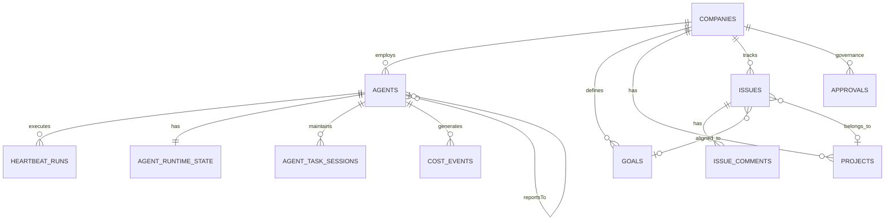

# Paperclip

> **Open-source orchestration for zero-human companies — a Node.js server + React UI that coordinates a team of AI agents to run a business.**

| Field | Value |
|-------|-------|
| Category | 🎛️ Orchestration Platforms |
| Repository | [paperclipai/paperclip](https://github.com/paperclipai/paperclip) |
| Publisher | Paperclip AI (startup) |
| License | Open Source (check repo) |
| Tech Stack | TypeScript monorepo (pnpm), Drizzle ORM, embedded PostgreSQL, Express, React |
| Maturity | 🟡 Early |
| Last Analyzed | 2026-03-07 |

---

## Burak's Notes

> *[Your personal observations, gut reactions, open questions, or ideas for how this tool connects to ongoing work. This section is yours — agents won't overwrite it.]*

---

## Relevance Scores

| Dimension | Score | Notes |
|-----------|-------|-------|
| **Relevance to our vision** | 6/10 | Conceptual alignment is strong (companies ≈ business lines, adapters ≈ harnesses), but adopting it would violate 3 of our 7 governing principles |
| **Novelty** | 5/10 | Per-token cost attribution and task-keyed session persistence are ahead of our current implementation |
| **Actionable** | 6/10 | Two patterns worth stealing: cost tracking schema and session persistence per task. Adapter interface useful as Day 60+ reference. |

---

## Overview

Paperclip is not a coding agent — it sits *above* agents (Claude Code, Codex, Cursor, OpenClaw, OpenCode) and coordinates them like a project manager. The system models "companies" as multi-tenant isolation units, each with independent budgets, agent teams, and an org hierarchy with `reportsTo` relationships.

The core execution engine is a heartbeat-driven model: agents are woken by timers, issue assignments, or manual triggers, do their work, and sleep. Each invocation is tracked as a "heartbeat run" with full lifecycle recording — stdout/stderr capture, token/cost extraction, runtime state updates, and live event publishing for real-time UI updates.

The data model spans 30+ PostgreSQL tables managed by Drizzle ORM, covering companies, agents, goals (hierarchical), issues (task board), heartbeat runs, cost events, agent runtime state, task sessions, approvals, and activity logs.

---

## Technical Architecture

**Key schema entities:**

| Table | Purpose | Notable Fields |
|-------|---------|----------------|
| **companies** | Multi-tenant isolation (≈ our "business line") | `budgetMonthlyCents`, `spentMonthlyCents`, `requireBoardApprovalForNewAgents` |
| **agents** | Agent definitions with org hierarchy | `reportsTo`, `adapterType`, `adapterConfig`, `budgetMonthlyCents`, `permissions` |
| **heartbeat_runs** | Every agent invocation record | `invocationSource`, `sessionIdBefore`/`After`, `usageJson`, `resultJson`, `contextSnapshot`, `exitCode` |
| **cost_events** | Per-token cost tracking | `provider`, `model`, `inputTokens`, `outputTokens`, `costCents`, per-issue/project/goal attribution |
| **agent_task_sessions** | Session persistence per task | `taskKey`, `sessionParamsJson` — allows agent to resume previous session for same task |
| **approvals** | Human governance gate | `type`, `requestedByAgentId`, `status` (pending/approved/denied) |

**The Adapter Pattern:** Pluggable modules for different agent harnesses (Claude, Codex, Cursor, OpenClaw, OpenCode). Each adapter knows how to spawn, stream, parse session IDs/costs, and resume sessions.

**The Heartbeat Engine (~600+ lines):** Handles wakeup requests, workspace resolution, session continuity, concurrency control (per-agent start locks), and run lifecycle tracking.

---

## Publisher Background

Paperclip AI is a startup building toward "zero-human companies." The project is open-source with active development. Key technical decisions (embedded PostgreSQL, Drizzle ORM, adapter pattern) suggest experienced Node.js/TypeScript developers. The ClipMart feature (company config portability/export) hints at a marketplace vision. Team size and funding status unclear.

---

## What's Valuable for Us

| Pattern to Study | Where in Paperclip | How to Apply |
|-----------------|-------------------|--------------| 
| **Per-token cost attribution** | `cost_events` schema | Add per-task, per-model cost tracking to our state files: `provider` + `model` + `inputTokens` + `outputTokens` + `costCents` + per-issue attribution. |
| **Agent session persistence per task** | `agent_task_sessions` + heartbeat service | When spawning an agent for a task, check if a previous session exists for that task key. Pass session ID to Claude Code's `--resume` flag. |
| **Adapter abstraction interface** | `AdapterExecutionResult`, `AdapterSessionCodec` | When adding Pi Agent or Codex support (Day 60+), study their adapter interface for the orchestrator ↔ harness contract. |
| **Workspace resolution** | `resolveWorkspaceForRun()` in heartbeat.ts | Their project workspace → task session workspace → agent home workspace resolution is cleaner than our ad-hoc worktree setup. |
| **Run lifecycle tracking** | `heartbeat_runs` schema | Run record (queued→running→completed/failed, with stdout/stderr excerpts, exit codes, context snapshots) is a good model for our devlog/state files. |

---

## What's NOT Relevant

> [!CAUTION]
> **Do NOT adopt Paperclip as a base.** Adopting it would violate 3 of our 7 governing principles.

| Principle Violated | How |
|-------------------|-----|
| **#2: Deterministic orchestration** | Paperclip's heartbeat model is more permissive — agents decide what to do. Ours mandates deterministic routing/state transitions. |
| **#3: Context is zero-sum** | No context engineering infrastructure. No tiers, budgets, progressive disclosure, or two-brain separation. |
| **#7: Build only what you needed** | Includes issue boards, labels, org charts, ClipMart, meeting-like approvals, invites, brand colors — massive unused surface area. |

Additional concerns: PostgreSQL in Phase 1 violates ADR-002, ~20K+ LoC of TypeScript to maintain, inherited dependency tree (Drizzle, Express, embedded Postgres, React), misaligned roadmap.

---

## Future Use Cases

- **Phase 1 (Days 1–3):** Add cost tracking to our state schema using their `cost_events` pattern.
- **Phase 1–2:** Add task-keyed session persistence using their `agent_task_sessions` model.
- **Phase 3 (Days 60–90):** Study their adapter interface when evaluating Pi Agent or Codex as additional harnesses.
- **Phase 4 (Days 90+):** If building a proper dashboard, their run lifecycle tracking schema is a good reference.

---

## Key Takeaway

> **Build our own, steal their cost tracking and session persistence models — Paperclip's per-token cost attribution and task-keyed session resumption are the two patterns worth adopting immediately, while ignoring the other 90% of the platform.**
