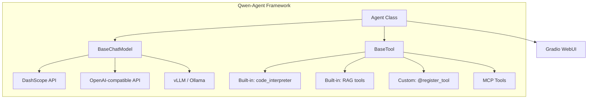

# Qwen-Agent

> **Agent framework and applications built upon Qwen≥3.0, featuring Function Calling, MCP, Code Interpreter, RAG, Chrome extension, and more.**

| Field | Value |
|-------|-------|
| Category | 🎛️ Orchestration Platforms |
| Repository | [QwenLM/Qwen-Agent](https://github.com/QwenLM/Qwen-Agent) |
| Publisher | Alibaba Cloud / Qwen Team (bigtech) |
| License | Apache-2.0 |
| Tech Stack | Python, Gradio (GUI), Qwen/DashScope API, OpenAI-compatible APIs, vLLM/Ollama support |
| Maturity | 🟢 Production |
| Last Analyzed | 2026-03-08 |

---

## Burak's Notes

> *[Your personal observations, gut reactions, open questions, or ideas for how this tool connects to ongoing work. This section is yours — agents won't overwrite it.]*

---

## Relevance Scores

| Dimension | Score | Notes |
|-----------|-------|-------|
| **Relevance to our vision** | 3/10 | Python-centric agent framework tightly coupled to the Qwen model ecosystem. Different language, different model strategy, different architecture philosophy. |
| **Novelty** | 4/10 | Tool-Integrated Reasoning (TIR) for math and the DeepPlanning benchmark are interesting research contributions, but not directly applicable. |
| **Actionable** | 2/10 | Little we can directly use. The `@register_tool` decorator pattern and multi-LLM backend support are already well-known patterns. |

---

## Overview

Qwen-Agent is Alibaba's official agent framework for the Qwen model family (Qwen3, Qwen3.5, QwQ, Qwen3-Coder). It provides atomic components (LLMs inheriting from `BaseChatModel`, Tools inheriting from `BaseTool`) and high-level components (Agents derived from `Agent`). The framework supports function calling, MCP integration, code interpreter (Docker-sandboxed), RAG, and a Gradio-based web UI.

The framework is designed to showcase and optimize for Qwen models via DashScope, though it supports any OpenAI-compatible API (vLLM, Ollama). Key recent additions include Qwen3.5 support, the DeepPlanning evaluation benchmark, MCP cookbooks, Tool-Integrated Reasoning for math, and specialized Qwen3-Coder tool-call demos.

The architecture follows a standard agent framework pattern: define tools, configure LLM, create agent with system message + tools + files, run in a loop. The assistant agent can read PDFs, use code interpreter, and call custom tools.

---

## Technical Architecture



**Key architectural components:**
- **`BaseChatModel`:** LLM abstraction with function calling support across multiple backends
- **`BaseTool`:** Tool base class with `description` and `parameters` for automatic schema generation
- **`Agent`:** Main orchestration class, with `Assistant` as the primary implementation
- **Code Interpreter:** Docker-sandboxed Python execution for math/data tasks
- **MCP:** Standard MCP server configuration (npx-based)
- **DeepPlanning:** Open-sourced agent evaluation benchmark

**Configuration is via dictionaries:**
```python
llm_cfg = {
    'model': 'qwen-max-latest',
    'model_type': 'qwen_dashscope',
    'generate_cfg': {'top_p': 0.8}
}
```

---

## Publisher Background

Built by the Qwen team at Alibaba Cloud, which is one of the leading LLM development teams globally. The Qwen model family spans from small (0.5B) to large (110B+), with specialized models for coding (Qwen3-Coder), vision (Qwen3-VL), and reasoning (QwQ). The team has a strong research track record with multiple state-of-the-art benchmarks. Qwen-Agent has 25 releases and is used by 141+ downstream projects on GitHub.

The framework is tightly coupled to the Qwen ecosystem — while it supports OpenAI-compatible APIs, the optimizations and prompts are tuned for Qwen models. DashScope is Alibaba Cloud's model serving platform.

---

## What's Valuable for Us

1. **DeepPlanning Benchmark:** Their open-sourced agent evaluation benchmark could be useful for comparing different agent architectures. Worth bookmarking for Phase 3+ when we need to evaluate agent performance systematically.

2. **Tool-Integrated Reasoning (TIR):** The pattern of interleaving LLM reasoning with tool execution (especially Python code execution) for complex problems is a validated approach. Not applicable to our coding agent use case, but interesting for future business analysis agents.

3. **`@register_tool` Pattern:** Clean decorator-based tool registration with automatic schema generation from `description` + `parameters`. This is a good reference for any future Python-based tool development, though we're a TypeScript/shell shop.

---

## What's NOT Relevant

| Feature | Why Not |
|---------|---------|
| **Python-centric framework** | Our stack is TypeScript/shell. Rewriting in Python adds a language boundary. |
| **Qwen model coupling** | We're Claude-first. Qwen models aren't in our stack. |
| **Gradio WebUI** | We don't want custom UIs (Master Blueprint §8.9). |
| **DashScope dependency** | Alibaba Cloud service, not in our infrastructure. |
| **Code Interpreter** | We use bash + agent execution. Docker-sandboxed Python isn't needed. |
| **RAG tools** | We've validated no-vector-DB approach (Always-On Memory Agent). |
| **Chrome extension** | Browser integration not in scope. |

---

## Future Use Cases

- **Phase 1–3:** Not relevant. Different language, model family, and architecture.
- **Phase 4 (Days 90+):** If we evaluate Qwen models as a cost optimization target (model routing), the framework's test suite and examples would be useful reference material.
- **Research:** The DeepPlanning benchmark could be adapted for evaluating our agent configurations.

---

## Key Takeaway

> **Qwen-Agent is Alibaba's well-built but Qwen-model-coupled Python agent framework — architecturally standard, technically solid, but irrelevant to our TypeScript/Claude/terminal-first autonomous orchestration stack.**
